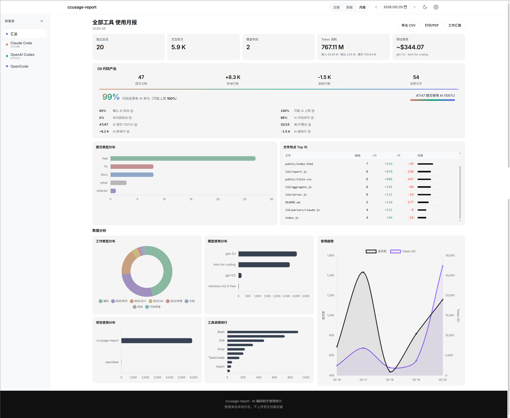
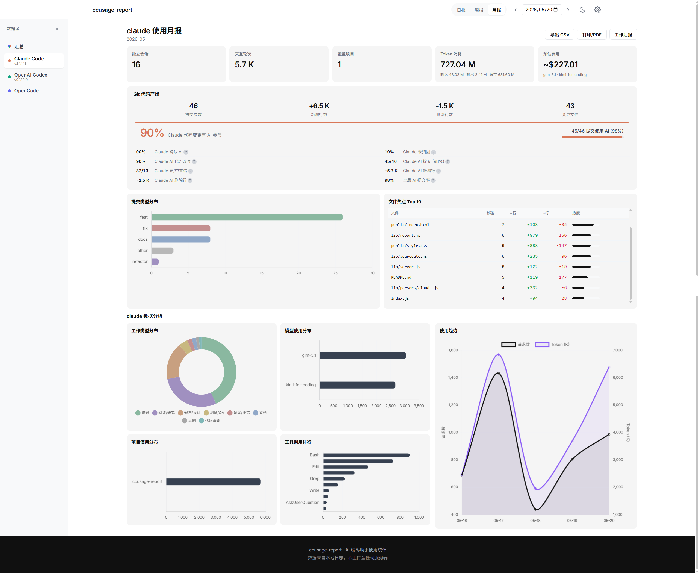
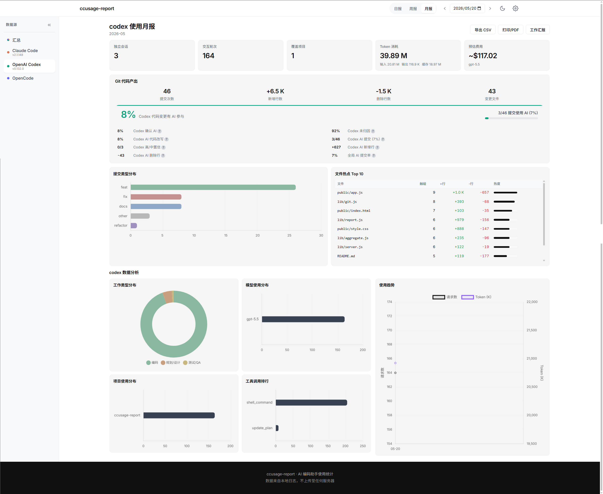
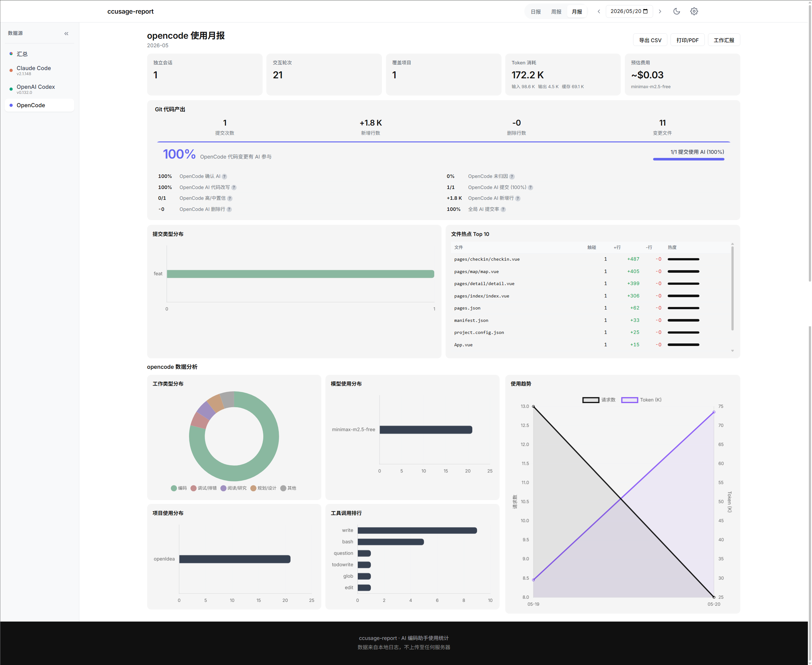
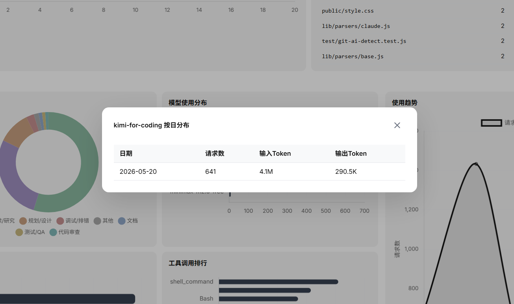
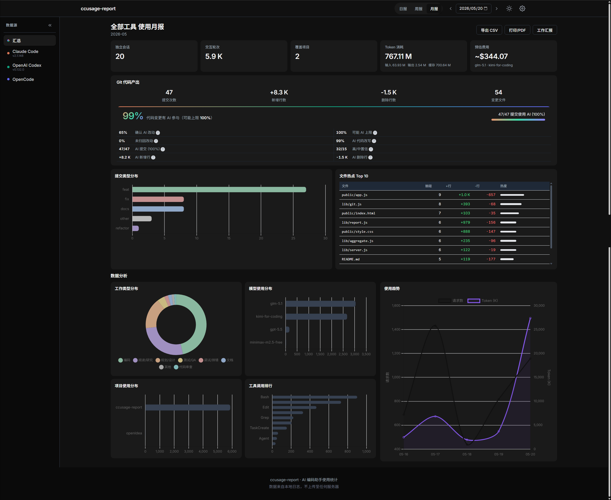

<div align="center">
  
  <h1>ccusage-report</h1>
  <p><strong>AI 编码工具帮你写了多少代码？一条命令见分晓。</strong></p>
</div>

<p align="center">
  <a href="https://www.npmjs.com/package/ccusage-report"></a>
  <a href="https://www.npmjs.com/package/ccusage-report"></a>
  <a href="LICENSE"></a>
  <a href="https://nodejs.org/"></a>
</p>

<p align="center">
  支持 <b>Claude Code · Codex · OpenCode</b> 三大 AI 编码工具 · 600+ 模型定价 · AI 贡献度归因 · 一键飞书/钉钉周报
</p>

<p align="center">
  <a href="README_EN.md">English</a> · <a href="#命令用法">命令</a> · <a href="#常见问题">FAQ</a> · <a href="#更新日志">更新日志</a>
</p>



---

## 它解决什么问题？

> 「这周 AI 帮你写了多少代码？」「订阅这些工具值不值？」—— 与其每周手算，不如一条命令搞定。

| 场景 | 用 ccusage-report 解决 |
|------|----------------------|
| **写周报** | 选周报 → 点「工作汇报 → 复制」→ 粘贴飞书/钉钉。**3 秒搞定。** |
| **证明 AI ROI** | 「本周 67% 提交有 AI 参与，AI 辅助新增 4,200 行，费用 $12.5」**有数据，有底气。** |
| **理解使用习惯** | 哪个项目用得最多？哪个模型最费 Token？什么时段是编码高峰？**一目了然。** |
| **追踪 AI 成本** | 内置 **600+ 模型定价**（含 GLM、Kimi、Qwen、DeepSeek 等），自动算出等效 API 花销 |

---

## 3 秒上手

```bash
# 全局安装
npm install -g ccusage-report
ccusage-report serve            # 启动 Web 服务，自动打开浏览器

# 或零安装直接使用
npx ccusage-report serve
```

**零配置启动** —— 自动检测 `~/.claude`、`~/.codex`、OpenCode 日志目录，从会话里推导项目路径。

---

> **亮点速览** — 从「Claude Code 单工具报告」进化为「**AI 编码全栈分析平台**」。
>
> | 亮点 | 说明 |
> |------|------|
> | 🔗 **三工具统一** | Claude Code / OpenAI Codex / OpenCode 数据全自动汇总，左侧标签一键切换 |
> | 🧠 **AI 归因引擎** | 多层置信度（显式签名 / 会话强关联 / 文件重叠），支持跨天提交匹配 |
> | 🏷️ **600+ 模型定价** | 集成 Portkey-AI/models 数据库，覆盖 OpenAI/Anthropic/Google/中国厂商（GLM/Kimi/Qwen/DeepSeek/MiniMax）等 |
> | 💡 **工作汇报洞察** | 每个板块自动生成一句话诊断解读，不只是数据罗列 |
> | 🔧 **工具使用模式** | 工具调用从排行升级为五类分布（编辑/阅读/执行/规划/研究） |
> | 📈 **时间趋势分析** | 周报/月报新增峰值日、连续活跃、趋势方向识别 |
> | 🔢 **动态板块编号** | 没数据的板块自动跳过编号，告别空板块 |

---

## 核心亮点

| 亮点 | 说明 |
|------|------|
| 🌐 **多工具统一平台** | 同时支持 Claude Code、OpenAI Codex、OpenCode，三工具数据自动汇总 |
| 🤖 **AI 贡献度量化** | 识别 `Co-Authored-By: Claude`、`Generated` 等签名，量化 AI 在你代码中的实际占比 |
| 📝 **自然语言工作汇报** | 段落式汇报含洞察解读、趋势分析、项目亮点；详报/简报 + 飞书/钉钉一键切换 |
| 💰 **精确费用估算** | 600+ 模型本地定价 + Portkey API 兜底，未知模型自动查询缓存 |
| 📦 **零配置开箱即用** | 首次运行自动检测工具目录、推导项目路径 |
| 🔍 **数据钻取** | 点击任意图表下钻明细，从汇总数据到具体会话/提交一气呵成 |

---

## 功能速览

| 模块 | 说明 |
|------|------|
| 多工具支持 | Claude Code / Codex / OpenCode 三合一，自动检测工具版本号 |
| 多周期报告 | 日报 / 周报 / 月报，支持指定任意日期 |
| AI 贡献度 | 多层归因引擎，识别 AI 辅助提交、统计行数占比、按工具维度过滤 |
| 工作汇报 | 自然语言摘要 + 洞察解读，标准 / 飞书 / 钉钉三种格式 |
| 使用趋势 | 折线图展示请求数与 Token 消耗时序，周/月报附峰值识别 |
| 费用估算 | 600+ 模型本地定价 + API 兜底，未知模型不计费而非乱算 |
| 工作类型分析 | 按编码/测试/调试/文档/审查/规划分类，匹配场景一目了然 |
| 文件热点 Top 10 | 按触碰次数排行最频繁变更的文件 |
| 提交类型分布 | 按 Conventional Commit 自动分类（feat/fix/refactor 等） |
| 工具使用模式 | 工具调用分类统计（代码编辑/阅读/执行/规划/研究） |
| 暗色模式 | 亮/暗主题一键切换，全图表自适配 |

---

## 产品截图

### 多工具汇总视图

> 全工具数据汇总，AI 贡献占比、Token 消耗、费用、活跃时段、模型分布、场景拆分一屏掌握。


### 单工具报告

> 切换左侧标签即可单独查看任一工具的数据。

<table>
  <tr>
    <td></td>
    <td></td>
  </tr>
  <tr>
    <td align="center"><b>Claude Code</b></td>
    <td align="center"><b>OpenAI Codex</b></td>
  </tr>
  <tr>
    <td></td>
    <td></td>
  </tr>
  <tr>
    <td align="center"><b>OpenCode</b></td>
    <td></td>
  </tr>
</table>

### 场景分析 & 模型分布

> 按工作类型分类（编码 / 测试 / 调试 / 文档 / 审查 / 规划），还能下钻看每个模型的具体 Token 用量。

<table>
  <tr>
    <td></td>
    <td></td>
  </tr>
  <tr>
    <td align="center">工作类型分布（含匹配关键词示例）</td>
    <td align="center">模型使用分布（含具体 Token 用量）</td>
  </tr>
</table>

### 工作汇报 · 一键生成可直接发布的周报

> 自然语言段落式汇报，覆盖 Token / 费用 / AI 贡献度 / 项目亮点 / 代码产出，每个板块附洞察解读。

- **详报** —— 完整数据 + 洞察解读 + 板块编号，适合周报、月报
- **简报** —— 3-5 句话核心摘要，适合日报或群消息
- **多平台格式** —— 标准 Markdown / 飞书 / 钉钉，一键切换

<table>
  <tr>
    <td></td>
    <td></td>
  </tr>
  <tr>
    <td align="center"><b>详报</b></td>
    <td align="center"><b>简报</b></td>
  </tr>
</table>

### 暗色模式

> 全图表配色自适配，长时间阅读不伤眼。



---

## 命令用法

```bash
ccusage-report <命令> [周期] [日期] [选项]
```

| 命令 | 说明 |
|------|------|
| `serve` | 启动 Web 服务（默认端口 4567） |
| `report` | 生成命令行报告（默认命令） |
| `init` | 初始化配置文件 |

| 周期 | 说明 |
|------|------|
| `daily` | 日报（默认） |
| `weekly` | 周报（自动计算所在周） |
| `monthly` | 月报（自动计算所在月） |

### 常用示例

```bash
# Web 模式（推荐）
ccusage-report serve

# 命令行日报
ccusage-report report daily
ccusage-report report daily 2026-05-15

# 周报 / 月报
ccusage-report report weekly
ccusage-report report monthly 2026-05-01

# 只统计指定项目
ccusage-report report daily --projects D:/fzwork,E:/play/idea

# 一键生成可发布的工作汇报
ccusage-report report daily --work          # 详报
ccusage-report report daily --work --brief  # 简报
ccusage-report report weekly --work
```

---

## 配置

v0.4.0 起支持 Claude Code、Codex、OpenCode 三种工具，**首次运行自动检测**已安装工具的日志目录与项目路径。

如需自定义，点击 Web 页面右上角设置按钮在线修改。

| 配置项 | 说明 |
|--------|------|
| Claude 日志目录 | Claude Code 数据目录（含 `projects/` 子目录），默认 `~/.claude` |
| Codex 日志目录 | Codex 数据目录（含 `sessions/` 子目录），默认自动检测 |
| OpenCode 日志目录 | OpenCode 数据目录，默认自动检测 |
| 启用工具 | 指定启用哪些工具，默认全部已检测到的工具 |
| 本地项目路径 | 关联的 Git 仓库路径，用于代码提交统计与 AI 贡献度归因 |
| 排除项目 | 不希望统计的项目名称 |
| 场景关键词 | 工作类型分类关键词 JSON |

### 模型定价数据

- **本地表**：内置 590 个来自 [Portkey-AI/models](https://github.com/Portkey-AI/models) 的厂商原命名定价
- **别名映射**：内置 28 条权威覆盖，把 `glm-5.1` / `kimi-for-coding` 等中转服务别名定向到正确定价
- **API 兜底**：未命中的新模型自动调用 Portkey 免费 API，成功结果缓存到 `data/pricing-cache.json`
- **失败降级**：API 不可用时该模型按 0 计费，不影响其他模型与报告生成

---

## 常见问题

| 问题 | 解决方案 |
|------|----------|
| 浏览器显示「暂无数据」 | 首次启动会引导配置；如已跳过，点击右上角设置按钮 |
| Windows 下日志目录不存在 | 默认路径为 `C:\Users\<用户名>\.claude`，确认该目录下有 `projects/` 子目录 |
| 端口 4567 被占用 | 设置环境变量：`set CCUSAGE_PORT=8080 && ccusage-report serve` |
| 找不到 Git 统计数据 | v0.2.0+ 已自动从会话 `cwd` 推导项目路径，仍未识别时可在设置中手动指定 |
| 费用显示 $0 | 该模型未在定价表中，可临时联网让 API 兜底，或在 `data/pricing.json` 的 `overrides` 中添加 `aliasOf` 别名 |

---

## 环境要求

- Node.js >= 18.0.0
- 已安装 Claude Code / Codex / OpenCode 中至少一个，并产生过会话日志

---

## 更新日志

### v0.4.0 (2026-05-22) — 多工具统一平台

从 Claude Code 单工具报告升级为 AI 编码全栈分析平台。

- **多工具支持** — 新增 OpenAI Codex CLI 和 OpenCode 解析器，三工具数据自动汇总
- **工具版本检测** — 自动读取各工具版本号显示在侧边栏
- **AI 归因引擎** — 多层置信度（显式签名 / Session 强关联 / 文件重叠），支持跨天提交匹配和按工具维度过滤
- **600+ 模型定价** — 集成 [Portkey-AI/models](https://github.com/Portkey-AI/models) 数据库，覆盖 OpenAI/Anthropic/Google/中国厂商；API 兜底未知模型；失败时不计费而非乱算
- **工作汇报洞察** — 每个板块新增一句话诊断性解读，不只是数据罗列
- **工具使用模式** — 工具调用从简单排行改为五类分布统计（编辑/阅读/执行/规划/研究）
- **时间趋势** — 周报/月报新增日维度活跃趋势分析（峰值日、连续活跃、趋势方向）
- **动态编号** — 汇报板块按实际数据动态编号，不再出现跳号
- **场景分类扩展** — 新增 Codex/OpenCode/Serena MCP 工具的场景映射
- **UI 优化** — AI 归因板块重设计、工具主题色（Claude 橙、Codex 绿、OpenCode 紫）、暗色模式细节修复
- **工作汇报修复** — 暗色模式切换不再误切回主报告页

### v0.3.0 (2026-05-19)

- **工作汇报平台适配** — 新增飞书、钉钉格式支持
- **详报/简报模式** — 工作汇报新增两种输出模式
- **修复刷新布局跳动** — 解决卡片初始挤在中间的问题
- **Markdown 渲染优化** — 自定义列表标记、分隔线、表格悬停效果、代码片段样式
- **AI 贡献度增强** — 改进置信度评分和文件级指标计算
- **暗色主题完善**

### v0.2.0 (2026-05-17) — Git 深度分析

围绕「AI 贡献度」与「工作汇报体验」两条主线重构升级。

- **Git 深度分析** — AI 辅助提交检测、贡献度指标、Conventional Commit 解析、文件热点 Top 10、Session ↔ Commit 关联
- **工作汇报重构** — 自然语言摘要引擎、多平台格式
- **零配置启动** — 自动检测日志目录和项目路径
- **子 agent 统计** — 自动解析子 agent Token 消耗
- **暗色模式** — 全图表配色重写

### v0.1.0 (2026-05-17)

首个正式发布版本，包含完整的报告生成和可视化功能。

---

## 支持项目

如果这个工具帮到你，不妨：

- **给个 Star** —— 让更多人看到这个工具
- **提 Issue** —— 报告 Bug 或建议新功能
- **提 PR** —— 欢迎贡献模型定价、场景关键词、工具适配

---

## 许可证

[MIT](LICENSE) © [zhangyaowen](https://github.com/yaowen51888-rich)
