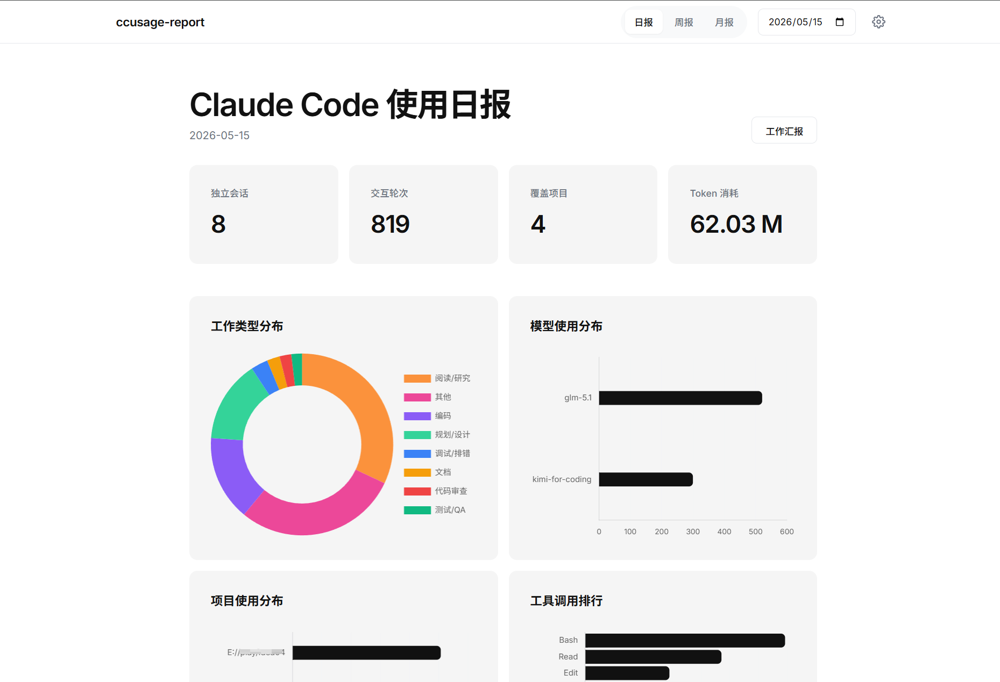
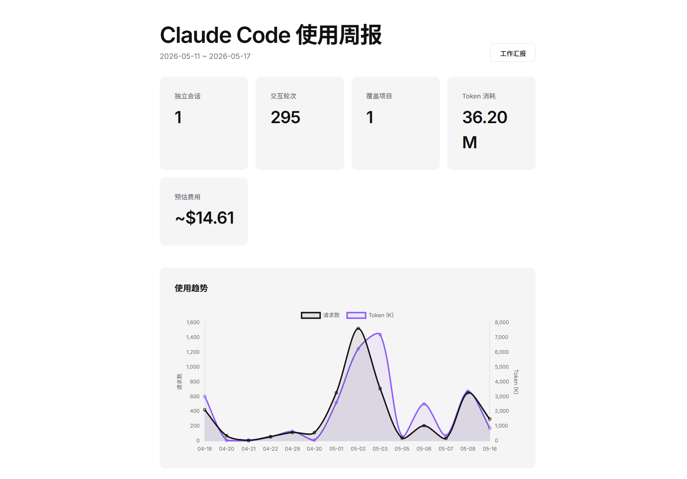
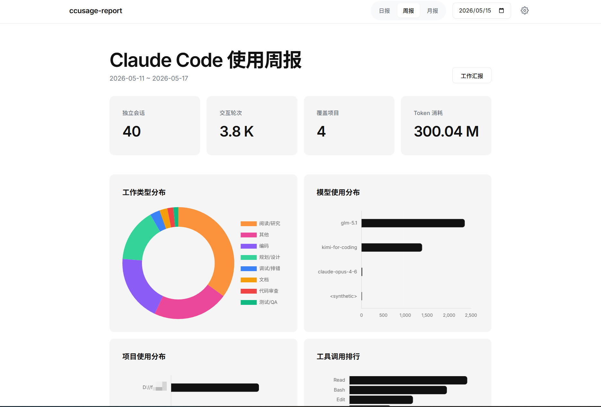
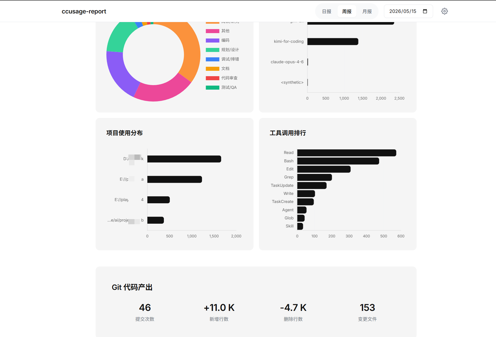
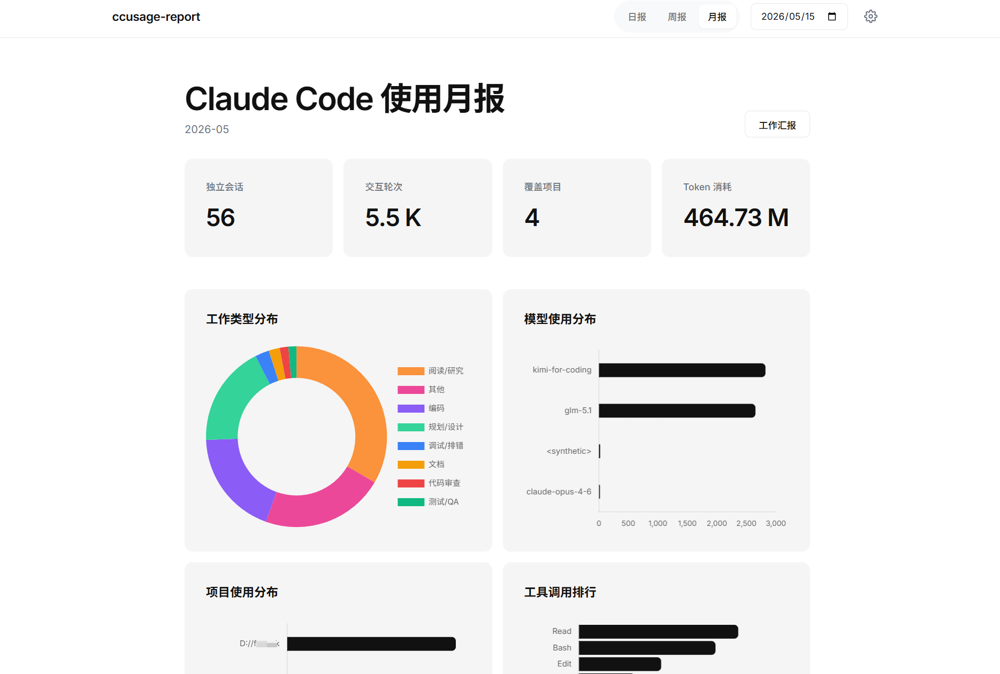
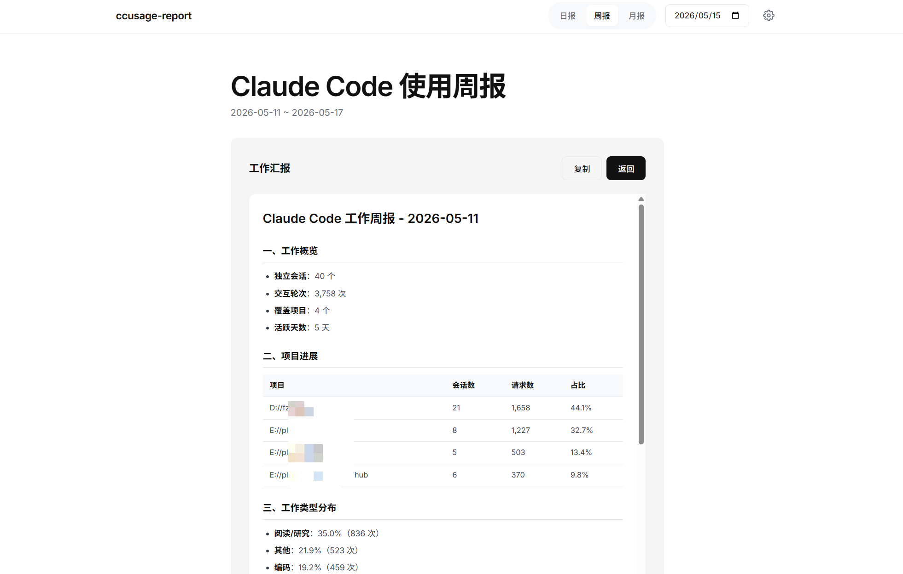
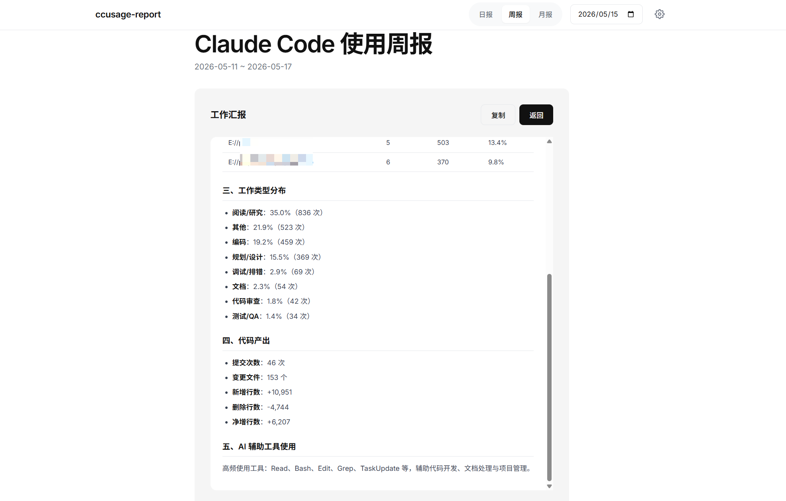
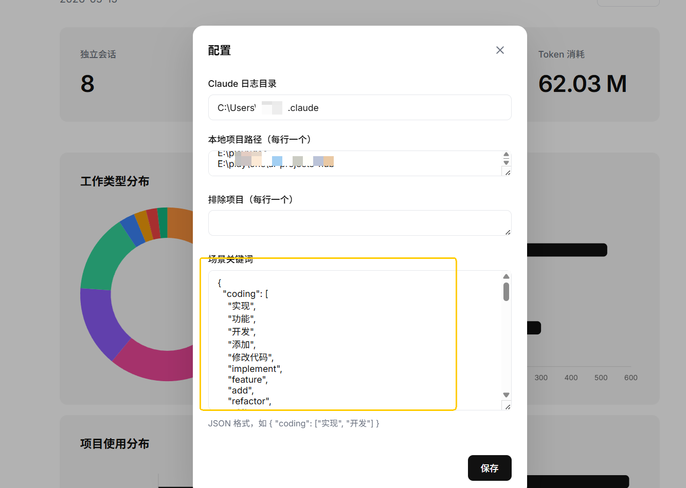

# ccusage-report

> 起因很简单：领导要看 AI 编程工具的使用数据和效率报告，手动统计太痛苦了，于是花了一个下午撸了这个小工具。没想到越用越顺手，干脆开源出来。

Claude Code 使用报告工具 — 从 JSONL 日志和 Git 仓库提取效率与使用指标，支持 Web 可视化和命令行两种模式。

## 环境要求

- Node.js >= 18.0.0

## 快速开始

```bash
# 无依赖，直接运行
cd ccusage-report

# 启动 Web 服务（自动打开浏览器）
node index.js serve

# 或直接生成命令行报告
node index.js report daily
```

Web 服务默认端口 `4567`，可通过环境变量修改：`set CCUSAGE_PORT=8080 && node index.js serve`

## 功能截图

### 日报



统计卡片展示会话数、请求数、项目数、Token 消耗和预估费用；趋势图展示近期使用走势；下方图表包含场景分布（环形图）、模型使用排名、项目分布和工具调用统计。

### 趋势图



支持日报（近 7 天）、周报（近 4 周）、月报（近 6 个月）的时间趋势折线图，双 Y 轴同时展示请求数和 Token 消耗变化。

### 周报





按周汇总所有指标，自动计算周一至周日的时间范围，Git 区域展示提交次数、新增/删除行数、变更文件数。

### 月报



按月汇总，自动计算当月起止日期，适合月度效率复盘。

### 工作汇报





点击「生成工作汇报」按钮，自动将数据转为 Markdown 格式的汇报文档，包含使用概览表格、场景分布、项目明细和 Git 指标，一键复制即可粘贴到飞书/钉钉/邮件。

### 在线设置



点击右上角设置按钮，可在线修改 Claude 数据目录、Git 仓库路径、排除项目和场景关键词。配置保存在浏览器本地，保存后即时刷新数据。

## 功能特性

| 特性 | 说明 |
|------|------|
| 多周期报告 | 日报、周报、月报，支持指定任意日期 |
| 使用趋势图 | 折线图展示请求数和 Token 消耗的时序变化 |
| 费用估算 | 基于模型定价自动计算预估 API 费用 |
| 场景分析 | 按编码/测试/调试/文档/审查/规划分类工作类型 |
| Git 统计 | 关联本地仓库，展示提交次数、代码行数变化 |
| 工作汇报 | 一键生成 Markdown 格式的周报/月报 |
| 浏览器配置 | 设置保存到 localStorage，跨会话持久化 |
| 离线可用 | Chart.js 和字体文件本地化，无需外部 CDN |

## 命令用法

```
node index.js <命令> [周期] [日期] [选项]
```

### 命令

| 命令 | 说明 |
|------|------|
| `serve` | 启动 Web 服务（默认端口 4567） |
| `report` | 生成使用报告（默认命令） |
| `init` | 初始化配置文件 |
| `help` | 显示帮助信息 |

### 周期

| 周期 | 说明 |
|------|------|
| `daily` | 日报（默认） |
| `weekly` | 周报（自动计算所在周） |
| `monthly` | 月报（自动计算所在月） |

### 选项

| 选项 | 说明 |
|------|------|
| `--projects <路径>` | 只统计指定项目，逗号分隔 |
| `--work` | 输出 Markdown 工作汇报格式 |

### 示例

```bash
# Web 模式
node index.js serve

# 命令行日报
node index.js report daily
node index.js report daily 2026-05-15

# 周报 / 月报
node index.js report weekly
node index.js report monthly 2026-05-01

# 只看指定项目
node index.js report daily --projects D://fzwork,E://play/idea

# 工作汇报格式（可直接复制用于日报/周报）
node index.js report daily --work
node index.js report weekly --work

# 初始化配置文件
node index.js init
```

## 配置

Web 模式下点击右上角设置按钮进行在线配置，配置保存在浏览器本地（localStorage）。

配置项说明：

| 配置项 | 说明 |
|--------|------|
| Claude 日志目录 | Claude Code 数据目录（含 `projects/` 子目录），默认自动检测 |
| 本地项目路径 | 关联的 Git 仓库路径，用于统计代码提交指标 |
| 排除项目 | 要排除的项目名称 |
| 场景关键词 | 场景分类关键词 JSON，按用户消息内容匹配工作类型占比 |

## 报告指标

| 类别 | 指标 |
|------|------|
| 使用概览 | 会话数、用户消息数、总请求数、活跃天数 |
| Token | 输入/输出/缓存命中/总消耗 |
| 费用估算 | 按模型定价计算的预估 API 费用 |
| 场景分布 | 编码、测试、调试、文档、审查、规划的占比 |
| 模型统计 | 各模型的请求次数和输出 Token |
| 项目排名 | 各项目的会话数和请求数 |
| 工具调用 | 最常用的工具及调用次数 |
| Git 指标 | 提交次数、新增行数、删除行数、变更文件数 |
| 使用趋势 | 按天的请求数和 Token 消耗变化曲线 |
