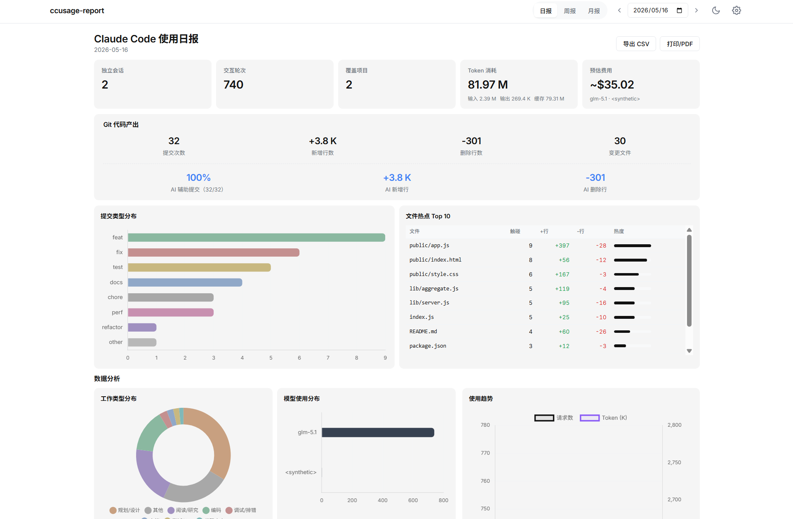
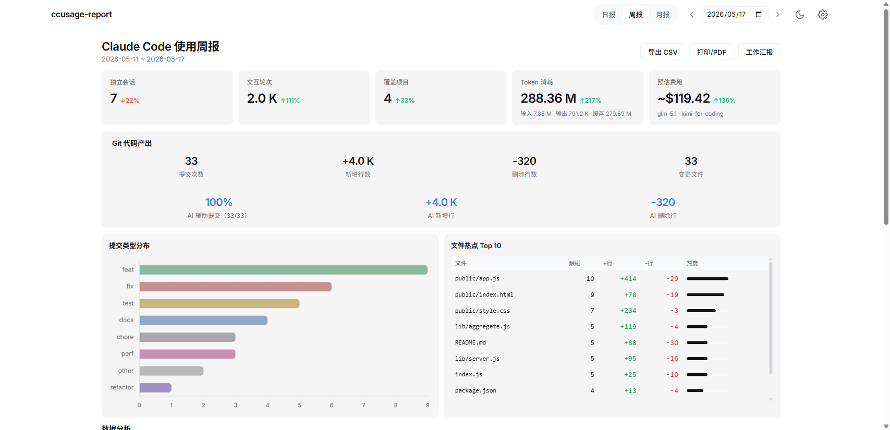
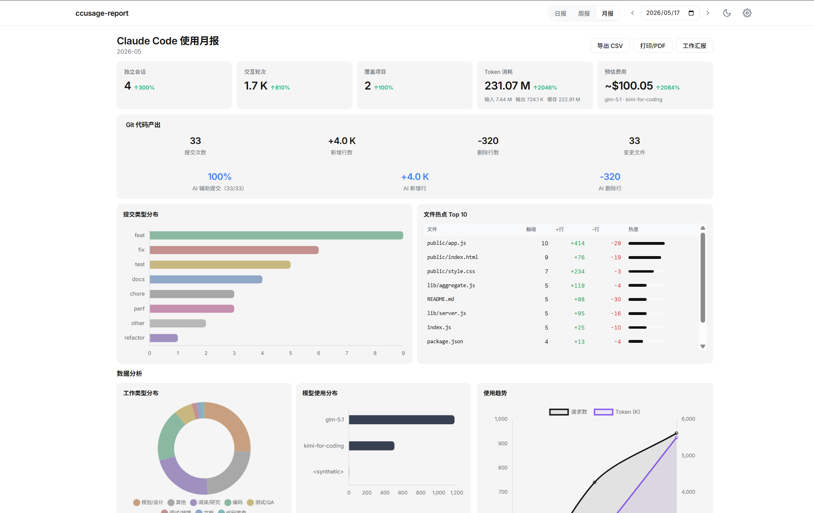
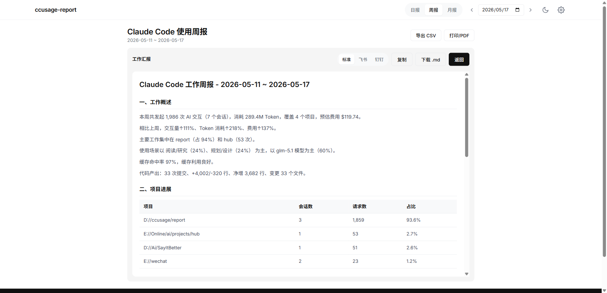
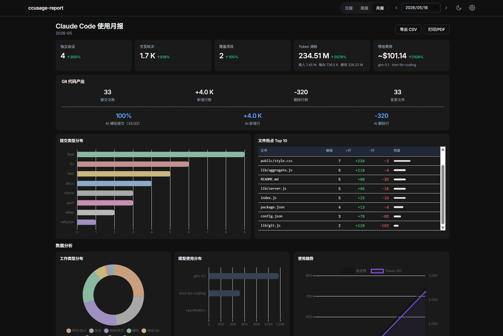

<div align="center">
  
  <h1>ccusage-report</h1>
</div>

<p align="center">
  <a href="https://www.npmjs.com/package/ccusage-report"></a>
  <a href="https://www.npmjs.com/package/ccusage-report"></a>
  <a href="LICENSE"></a>
  <a href="https://nodejs.org/"></a>
</p>

> **量化你的 AI 编程效率** —— 从 Claude Code 的 JSONL 日志和 Git 仓库中，自动提取会话数据、Token 消耗、AI 贡献度和代码产出，生成可视化的日报/周报/月报，以及可直接复制的工作汇报。



## 为什么用它？

| 痛点 | 解决方案 |
|------|---------|
| 老板问"AI 工具值不值"，答不上来 | 自动生成包含 Token 消耗、费用估算、代码产出的数据报告 |
| 手动统计太痛苦，每周花半天 | 一条命令出报告，Web 页面实时查看 |
| 写周报时不知道这周干了什么 | 自然语言摘要 + 多平台格式（飞书/钉钉），一键复制粘贴 |
| 不知道 AI 到底帮我写了多少代码 | AI 贡献度分析：自动识别 AI 辅助提交，统计 AI 新增/删除行数占比 |

## 3 秒上手

```bash
# 全局安装
npm install -g ccusage-report

# 启动 Web 服务（自动打开浏览器）
ccusage-report serve
```

零配置启动 —— 自动检测 `~/.claude` 日志目录和项目路径。

```bash
# 或零安装直接使用
npx ccusage-report serve
```

## 核心亮点

- **AI 贡献度分析** — 通过 `Co-Authored-By: Claude`、`🤖 Generated` 等签名自动识别 AI 辅助提交，量化 AI 在你的代码中的实际占比
- **自然语言工作汇报** — 不再复制干巴巴的表格，自动生成带环比分析、项目亮点、效率洞察的段落式汇报，支持飞书/钉钉格式
- **零配置开箱即用** — 首次运行自动检测日志目录和项目路径，无需手动编辑配置文件
- **多周期报告** — 日报、周报、月报一键切换，支持环比趋势对比
- **费用估算** — 基于各模型定价自动计算预估 API 费用
- **数据钻取** — 点击任意图表可下钻查看明细数据
- **暗色模式** — 全站暗色主题，所有图表配色保持一致体验

## 功能速览

| 功能 | 说明 |
|------|------|
| 📊 **多周期报告** | 日报 / 周报 / 月报，支持指定任意日期 |
| 🤖 **AI 贡献度** | 识别 AI 辅助提交，统计 AI 新增/删除行数占比 |
| 📝 **工作汇报** | 自然语言摘要，支持标准 Markdown / 飞书 / 钉钉格式 |
| 📈 **使用趋势** | 折线图展示请求数和 Token 消耗的时序变化 |
| 💰 **费用估算** | 基于模型定价自动计算预估 API 费用 |
| 🏷️ **提交类型分布** | 按 Conventional Commit 自动分类（feat/fix/refactor 等） |
| 🔥 **文件热点 Top 10** | 按触碰次数排行变更最频繁的文件 |
| 🎯 **场景分析** | 按编码/测试/调试/文档/审查/规划分类工作类型 |
| 📤 **导出** | CSV / PDF / Markdown 一键导出 |
| 🌙 **暗色模式** | 亮/暗主题一键切换 |

### 周报



### 月报



### 工作汇报（自然语言摘要 + 多平台格式）



### 暗色模式



## 命令用法

```bash
node index.js <命令> [周期] [日期] [选项]
```

| 命令 | 说明 |
|------|------|
| `serve` | 启动 Web 服务（默认端口 4567） |
| `report` | 生成使用报告（默认命令） |
| `init` | 初始化配置文件 |

| 周期 | 说明 |
|------|------|
| `daily` | 日报（默认） |
| `weekly` | 周报（自动计算所在周） |
| `monthly` | 月报（自动计算所在月） |

### 示例

```bash
# Web 模式
ccusage-report serve

# 命令行日报
ccusage-report report daily
ccusage-report report daily 2026-05-15

# 周报 / 月报
ccusage-report report weekly
ccusage-report report monthly 2026-05-01

# 只看指定项目
ccusage-report report daily --projects D://fzwork,E://play/idea

# 工作汇报格式（可直接复制用于日报/周报）
ccusage-report report daily --work
ccusage-report report weekly --work
```

## 环境要求

- Node.js >= 18.0.0

## 配置

v0.2.0 起首次运行**自动检测** Claude 日志目录与项目路径，通常无需手动配置。

如需自定义，可点击 Web 页面右上角设置按钮在线修改，配置保存在浏览器本地（localStorage）。

| 配置项 | 说明 |
|--------|------|
| Claude 日志目录 | Claude Code 数据目录（含 `projects/` 子目录），默认自动检测 `~/.claude` |
| 本地项目路径 | 关联的 Git 仓库路径，用于统计代码提交、AI 贡献度 |
| 排除项目 | 要排除的项目名称 |
| 场景关键词 | 场景分类关键词 JSON |

## 常见问题

| 问题 | 解决方案 |
|------|----------|
| 浏览器显示"暂无数据" | 首次启动会引导配置；如已跳过，可点击右上角设置按钮 |
| Windows 下日志目录不存在 | 默认路径为 `C:\Users\<用户名>\.claude`，确认该目录下有 `projects/` 子目录 |
| 端口 4567 被占用 | 设置环境变量：`set CCUSAGE_PORT=8080 && ccusage-report serve` |
| 找不到 Git 统计数据 | v0.2.0 已自动从会话 `cwd` 推导项目路径，仍未识别时可在设置中手动指定 |

## 更新日志

### v0.2.7 (2026-05-18)

- 修复 package.json 格式，确保 npm 发布零警告

### v0.2.0 (2026-05-17)

围绕「AI 贡献度」与「工作汇报体验」两条主线重构升级。

- **Git 深度分析**：AI 辅助提交检测、AI 贡献度指标、Conventional Commit 解析、文件热点 Top 10、Session ↔ Commit 关联
- **工作汇报重构**：自然语言摘要引擎、多平台格式（标准/飞书/钉钉）
- **零配置启动**：自动检测日志目录和项目路径
- **子 agent 统计**：自动解析子 agent Token 消耗
- **暗色模式**：全图表配色重写为 monochrome 灰阶色板

### v0.1.0 (2026-05-17)

首个正式发布版本，包含完整的报告生成和可视化功能。

## 许可证

[MIT](LICENSE)
