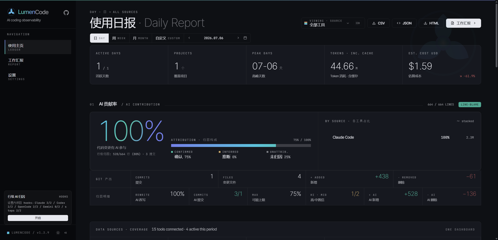
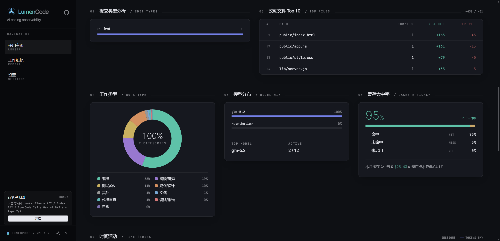
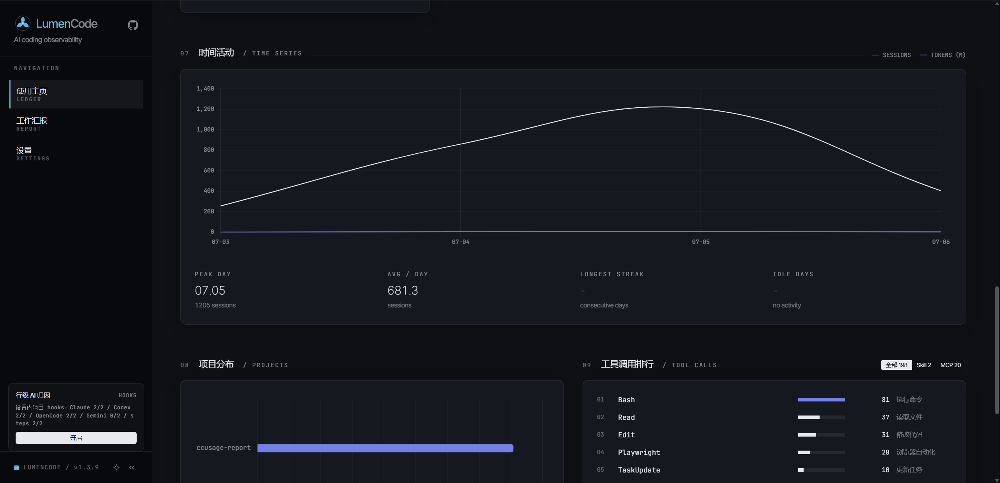
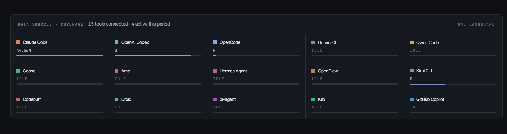
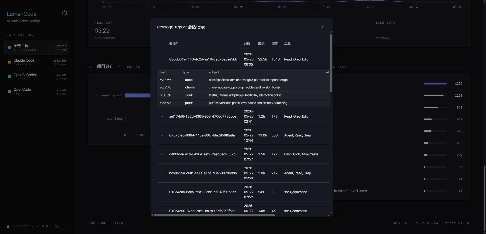
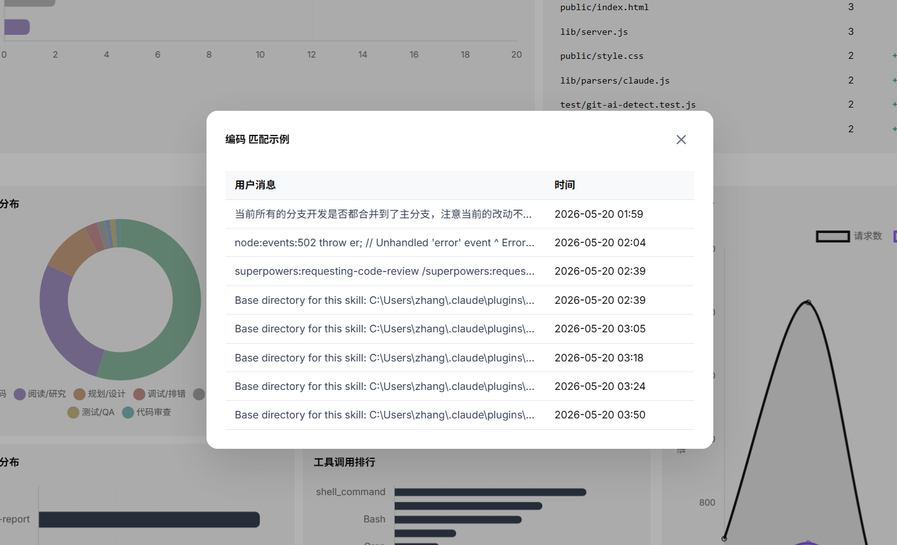
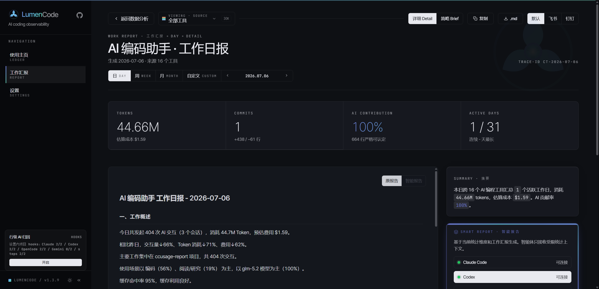
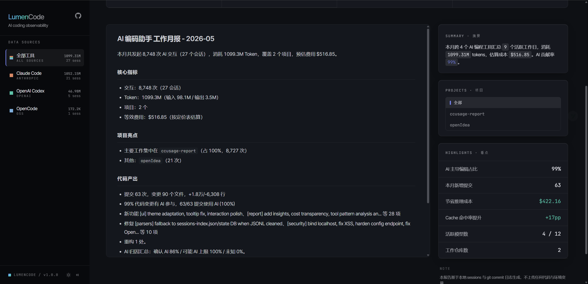
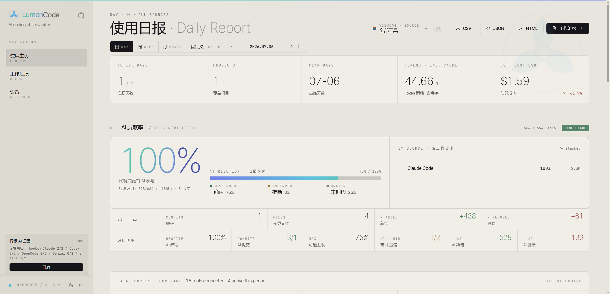

<div align="center">
  
</div>


<p align="center">
  <a href="https://www.npmjs.com/package/lumencode"></a>
  <a href="https://www.npmjs.com/package/lumencode"></a>
  <a href="LICENSE"></a>
  <a href="https://nodejs.org/"></a>
</p>

<p align="center">
  <b>AI 编码助手使用分析</b> —— 精确到每一行代码的 AI 归因 · 三工具统一 · 智能周报生成
</p>

<p align="center">
  <a href="README_EN.md">English</a> · <a href="#命令用法">命令</a> · <a href="#常见问题">FAQ</a> · <a href="#更新日志">更新日志</a>
</p>
<div align="center">
  
</div>

---


## 它解决什么问题？

> 「AI 帮你写了多少代码？」「订阅这些工具值不值？」—— 与其手算，不如一条命令搞定。

| 场景 | 用 lumencode 解决 |
|------|----------------------|
| **精确量化 AI 贡献** | 不是模糊的"大概写了不少"，而是精确到「4,200 行代码中 3,180 行由 AI 辅助完成」。**每一行都有数可查。** |
| **证明 AI ROI** | 周报自动生成：「本周 AI 辅助 12 个提交，节省约 8 小时编码时间，Token 花费 $18.5」。**老板一看就懂。** |
| **写周报/月报** | 选周期 → 点「工作汇报 → 复制」→ 粘贴飞书/钉钉。**3 秒搞定。** |
| **按项目汇报** | 多项目并行时，选择单个项目生成独立汇报，方便向不同项目负责人对齐 |
| **对齐 Sprint 周期** | 支持自定义起止日期，不再被日/周/月固定周期限制 |
| **追踪 AI 成本** | 600+ 模型内置定价（含 GLM、Kimi、Qwen、DeepSeek），自动算出等效 API 花销 |

---

## 3 秒上手

```bash
# 全局安装（指定最新版本）
npm install -g lumencode@latest
lumencode serve            # 启动 Web 服务，自动打开浏览器

# 如果之前装过旧版本，先更新：
npm update -g lumencode

# 验证版本（确保 ≥ 1.3.7）
lumencode --version

# 或零安装直接使用
npx lumencode@latest serve
```

> ⚠️ **遇到旧版本？** 运行 `npm cache clean --force && npm install -g lumencode@latest` 强制刷新缓存后重装。

**零配置启动** —— 自动检测 `~/.claude`、`~/.codex`、OpenCode 日志目录，从会话里推导项目路径。

---

## 产品亮点

<div align="center">
  
</div>


| 亮点 | 说明 |
|------|------|
| 🎯 **行级 AI 归因** | 通过 hook 步骤追踪，精确识别每一行代码的 AI 参与度。不是"这个提交 AI 帮忙了"，而是"这行代码是 AI 写的" |
| 🌐 **三工具统一** | Claude Code / Codex / OpenCode 数据全自动汇总，左侧标签一键切换 |
| 📝 **自然语言工作汇报** | 详报/简报一键生成，支持标准 Markdown / 飞书 / 钉钉三种格式，每个板块附诊断解读 |
| 🤖 **智能报告生成** | 连接本地 OpenCode CLI，对受限统计上下文和原始工作汇报做 AI 分析，支持默认风格与面向领导汇报的「牛马」风格 |
| 📂 **按项目独立汇报** | 右侧面板选择项目，生成该项目的独立工作汇报（commits + AI 交互量 + 热点文件） |
| 📅 **自定义时间范围** | 除日/周/月外，支持选择任意起止日期，方便对齐 Sprint 周期 |
| 💰 **精确费用估算** | 600+ 模型本地定价（含 GLM/Kimi/Qwen/DeepSeek）+ Portkey API 兜底，未知模型不计费而非乱算 |
| 📦 **零配置开箱即用** | 首次运行自动检测工具目录、推导项目路径 |
| 🔍 **数据钻取** | 点击任意图表下钻明细，从汇总数据到具体会话/提交一气呵成 |
| 📈 **趋势与洞察** | 周报/月报附峰值日识别、连续活跃分析、工具使用五类分布（编辑/阅读/执行/规划/研究） |
| 🌙 **亮/暗主题** | 亮色/暗色主题一键切换，全图表自适配 |

---

## 产品截图

### 数据分析总览

> 左侧数据源面板一键切换工具，主区域汇总 Token 消耗、费用、模型分布、AI 贡献度归因。

<table>
  <tr>
    <td></td>
    <td></td>
  </tr>
  <tr>
    <td align="center">汇总指标 + Token 趋势</td>
    <td align="center">项目分布 + 时段分布 + 会话列表</td>
  </tr>
</table>



### 多工具维度

> 切换到「全部工具」视图，查看跨工具的汇总数据与对比分析。



### 项目分布 & 会话记录

> 按项目统计 Token、费用、会话数，点击下钻查看单条会话明细。



### 场景分析

> 按工作类型分类（编码 / 测试 / 调试 / 文档 / 审查 / 规划），附匹配关键词示例。



### 工作汇报 · 一键生成可直接发布的周报

> 自然语言段落式汇报，覆盖 Token / 费用 / AI 贡献度 / 项目亮点 / 代码产出，每个板块附洞察解读。

- **详报** —— 完整数据 + 洞察解读 + 板块编号，适合周报、月报
- **简报** —— 3-5 句话核心摘要，适合日报或群消息
- **智能报告** —— 页面内调用本地 OpenCode CLI 生成 AI 分析报告，补充数据摘要、工作亮点分析、关键洞察、风险与建议
- **风格选择** —— 生成前可选择默认风格，或「牛马」风格输出更适合向领导汇报的表达倾向
- **持久化与更新提醒** —— 智能报告会按周期、项目、报告层级和风格保存；统计数据变化后提示重新生成
- **多平台格式** —— 标准 Markdown / 飞书 / 钉钉，一键切换
- **按项目生成** —— 右侧面板选择项目，生成该项目的独立汇报

<table>
  <tr>
    <td></td>
    <td></td>
  </tr>
  <tr>
    <td align="center"><b>详报</b></td>
    <td align="center"><b>简报</b></td>
  </tr>
</table>

### 亮色 / 暗色主题

> 全图表配色自适配，长时间阅读不伤眼。



> 暗色模式为默认主题，上方截图均为暗色模式下的效果。

---

## 命令用法

```bash
lumencode <命令> [周期] [日期] [选项]
```

| 命令 | 说明 |
|------|------|
| `serve` | 启动 Web 服务（默认端口 4567） |
| `report` | 生成命令行报告（默认命令） |
| `init` | 初始化配置文件 |
| `mcp` | 启动 MCP Server，供 Claude Code / Cursor 等调用（详见 [MCP Server](#mcp-server)） |

| 周期 | 说明 |
|------|------|
| `daily` | 日报（默认） |
| `weekly` | 周报（自动计算所在周） |
| `monthly` | 月报（自动计算所在月） |

### 常用示例

```bash
# Web 模式（推荐）
lumencode serve

# 命令行日报
lumencode report daily
lumencode report daily 2026-05-15

# 周报 / 月报
lumencode report weekly
lumencode report monthly 2026-05-01

# 只统计指定项目
lumencode report daily --projects D:/fzwork,E:/play/idea

# 一键生成可发布的工作汇报
lumencode report daily --work          # 详报
lumencode report daily --work --brief  # 简报
lumencode report weekly --work
```

---

## 配置

v0.4.0 起支持 Claude Code、Codex、OpenCode 三种工具，**首次运行自动检测**已安装工具的日志目录与项目路径。

如需自定义，点击 Web 页面右上角设置按钮在线修改。

| 配置项 | 说明 |
|--------|------|
| Claude 日志目录 | Claude Code 数据目录（含 `projects/` 子目录），默认 `~/.claude` |
| Codex 日志目录 | Codex 数据目录（含 `sessions/` 子目录），默认自动检测 |
| OpenCode 日志目录 | OpenCode 数据目录，默认自动检测 |
| 启用工具 | 指定启用哪些工具，默认全部已检测到的工具 |
| 本地项目路径 | 关联的 Git 仓库路径，用于代码提交统计与 AI 贡献度归因 |
| 排除项目 | 不希望统计的项目名称 |
| 场景关键词 | 工作类型分类关键词 JSON |

### 行级 AI 归因（可选增强）

行级归因通过 AI 编程工具 hook 记录文件编辑步骤，用于把 AI 贡献从提交级/文件级细化到行级。Claude Code 优先使用 `PostToolBatch`，Codex 使用 `PostToolUse`，OpenCode 使用项目级插件。该功能默认按需启用：没有初始化数据库时 hook 会静默跳过，不影响正常使用。

```bash
# 在需要统计的 Git 项目根目录执行
node index.js hooks status
node index.js hooks enable       # 交互式选择工具、初始化 steps 并自动备份配置
```

开启时只会修改当前项目的本地配置（`.claude/settings.local.json`、`.codex/config.toml`、`.opencode/plugins/lumencode-step-tracker.js`），不会修改全局配置或其它项目。关闭可执行：

```bash
node index.js hooks disable
```

数据写入当前项目的 `.ccusage/steps.db`。该数据库包含用于归因的文件快照，已在本项目 `.gitignore` 中默认忽略；如果在其它仓库启用，也建议忽略 `.ccusage/`。

### 模型定价数据

- **本地表**：内置 590 个来自 [Portkey-AI/models](https://github.com/Portkey-AI/models) 的厂商原命名定价
- **别名映射**：内置 28 条权威覆盖，把 `glm-5.1` / `kimi-for-coding` 等中转服务别名定向到正确定价
- **API 兜底**：未命中的新模型自动调用 Portkey 免费 API，成功结果缓存到 `data/pricing-cache.json`
- **失败降级**：API 不可用时该模型按 0 计费，不影响其他模型与报告生成

---

## MCP Server

LumenCode 内置 MCP Server，把 AI 编码分析能力暴露为 7 个工具，可供 **Claude Code / Cursor / Windsurf** 等支持 MCP 的客户端直接调用——在对话里就能查用量、生成周报、分析代码贡献度，无需切换到 Web 界面。

### 工具清单

| 工具 | 说明 |
|------|------|
| `usage_summary` | AI 用量概览：Token 消耗、成本、会话数、模型分布 |
| `daily_report` | 生成指定日期的使用报告（Markdown） |
| `work_report` | 工作汇报（周报/月报），支持 normal / brief / boss 三种风格 |
| `session_list` | 列出指定时间范围内的 AI 编码会话 |
| `trend_analysis` | 用量趋势：日级 Token、成本、请求量变化 |
| `ai_contribution` | 指定仓库的 AI 代码贡献度：贡献率、commit 归因、热点文件 |
| `cost_breakdown` | 成本分解：按模型 / 项目统计费用与缓存命中率 |

### 配置方式

**方式一：全局安装后（推荐）**

```bash
npm install -g lumencode@latest
```

在客户端的 MCP 配置中添加（以 Claude Code 的 `settings.json` 为例）：

```json
{
  "mcpServers": {
    "lumencode": {
      "command": "lumencode-mcp"
    }
  }
}
```

**方式二：源码 / 开发模式**

```json
{
  "mcpServers": {
    "lumencode": {
      "command": "node",
      "args": ["src/mcp/server.js"]
    }
  }
}
```

Cursor / Windsurf 等客户端的配置字段名同为 `mcpServers`，按各自设置入口填入即可。也可用 `npm run mcp` 或 `lumencode-mcp` 直接前台启动调试。

### 特性

- **零配置**：自动检测 `~/.claude` / `~/.codex` / OpenCode 日志目录，从会话推导项目路径，无需手动指定
- **stdio 传输**：标准 MCP stdio 协议；首次调用时扫描并缓存日志，后续复用
- **结果一致**：所有工具与 Web 端 / CLI 共用 `lib/` 下的统计与归因实现

配置完成后即可在 AI 助手中直接提问，例如「我这周 AI 编码花了多少成本？」「分析 idea 仓库的 AI 贡献度」「生成本周工作汇报」。

---

## 常见问题

| 问题 | 解决方案 |
|------|----------|
| 浏览器显示「暂无数据」 | 首次启动会引导配置；如已跳过，点击右上角设置按钮 |
| Windows 下日志目录不存在 | 默认路径为 `C:\Users\<用户名>\.claude`，确认该目录下有 `projects/` 子目录 |
| 端口 4567 被占用 | 设置环境变量：`set LUMENCODE_PORT=8080 && lumencode serve` |
| 找不到 Git 统计数据 | v0.2.0+ 已自动从会话 `cwd` 推导项目路径，仍未识别时可在设置中手动指定 |
| 费用显示 $0 | 该模型未在定价表中，可临时联网让 API 兜底，或在 `data/pricing.json` 的 `overrides` 中添加 `aliasOf` 别名 |

---

## 环境要求

- Node.js >= 18.0.0
- 已安装 Claude Code / Codex / OpenCode 中至少一个，并产生过会话日志

---

## 最近更新

### v1.3.7 (2026-06-25)

MCP Server（7 个分析工具） · AI-Metrics trailer 行级归因 · 智能报告管理汇报质量约束 · 统计/汇报页面查询缓存与并行优化 · 归因与日期过滤修复

### v1.3.5 (2026-06-11)

数据快照口径约束 · 外推不确定性标注 · Codex 行级归因修复 · 跨智能体风格共享 · SMART REPORT 视觉增强

📖 [完整更新日志 → Releases](https://github.com/yaowen51888-rich/lumencode/releases)

---

## 支持项目

如果这个工具帮到你，不妨：

- **给个 Star** —— 让更多人看到这个工具
- **提 Issue** —— 报告 Bug 或建议新功能
- **提 PR** —— 欢迎贡献模型定价、场景关键词、工具适配

---

## 许可证

[MIT](LICENSE) © [zhangyaowen](https://github.com/yaowen51888-rich)
