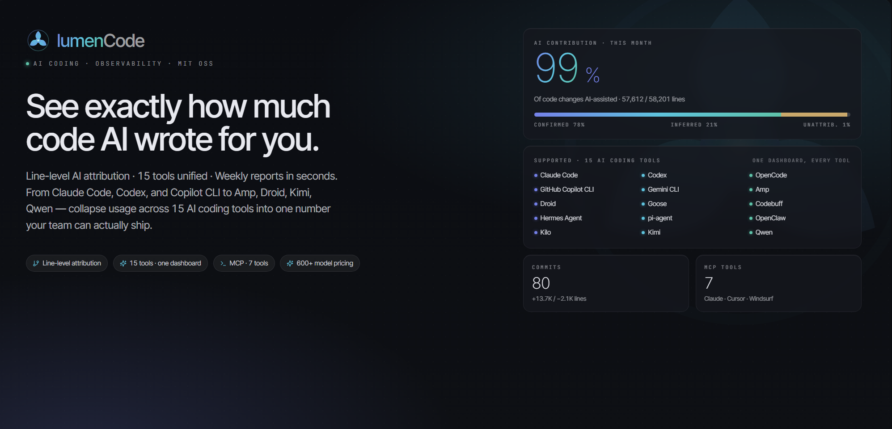
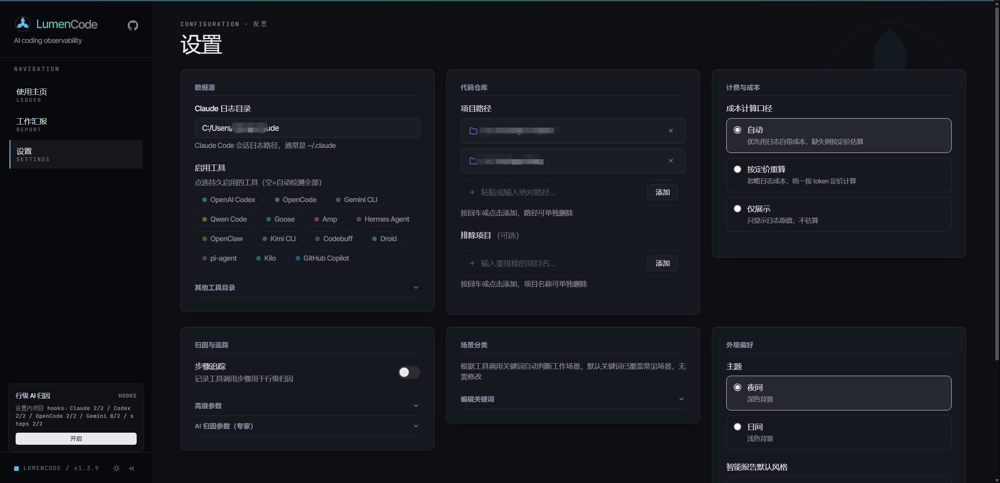

<div align="center">
  
</div>


<p align="center">
  <a href="https://www.npmjs.com/package/lumencode"></a>
  <a href="https://www.npmjs.com/package/lumencode"></a>
  <a href="https://github.com/yaowen51888-rich/lumencode"></a>
  <a href="LICENSE"></a>
  <a href="https://nodejs.org/"></a>
</p>

<p align="center">
  <b>AI Coding Assistant Analytics</b> — One command to see exactly how much code AI wrote for you
</p>

<p align="center">
  15-Tool Unified · Line-Level AI Attribution · 600+ Model Cost Estimation · One-Click Weekly Report
</p>

<p align="center">
  <a href="README.zh-CN.md">中文版</a> · <a href="#cli-usage">CLI</a> · <a href="#mcp-server">MCP</a> · <a href="#faq">FAQ</a> · <a href="#whats-new">Changelog</a>
</p>
<div align="center">
  
</div>

---


## What problem does it solve?

> "How much code did AI write?" "Are these AI subscriptions worth it?" — Stop calculating manually. One command does it all.

| Scenario | Solved by LumenCode |
|----------|--------------------------|
| **Precise AI Contribution** | Not vague "AI helped a lot" — "3,180 out of 4,200 lines were AI-assisted." **Every line accounted for.** |
| **Proving AI ROI** | Auto-generated weekly report: "This week AI assisted 12 commits, 3,180 lines attributed to AI, cost $18.50." **Every number is traceable.** |
| **Weekly reports in 3 seconds** | Pick period → click "Work Summary → Copy" → paste into Lark/DingTalk. **Done in 3 seconds.** |
| **Per-project reporting** | Configure multiple projects, then select one to generate an independent report for each project lead |
| **Sprint cycle alignment** | Beyond daily/weekly/monthly — pick any start/end date, no longer limited to fixed periods |
| **Tracking AI costs** | Built-in **600+ model pricing** (incl. GLM, Kimi, Qwen, DeepSeek), auto-calculates equivalent API cost |

---

## How does it compare to `ccusage`?

Both LumenCode and [`ccusage`](https://github.com/ccusage/ccusage) read the same local logs from the same 15 agent CLIs. The difference is *what you can do with the data* — LumenCode adds a Web UI, an MCP server, and line-level AI attribution on top.

| | **ccusage** | **LumenCode** |
|---|:---:|:---:|
| **Interface** | CLI | **CLI + Web UI + MCP** |
| **Line-level AI attribution** | — | ✅ "this line was written by AI" |
| **Publishable report** | terminal / JSON | **Markdown / Lark / DingTalk** · Detailed / Brief |
| **AI-generated smart report** | — | ✅ calls local agent for insights |
| **Drill-down dashboard** | — | ✅ click chart → session / commit |
| **Tools supported** | 15 | 15 (same set) |
| **Cost & pricing** | ✅ offline + custom overrides | ✅ **600+ models** bundled (GLM / Kimi / Qwen / DeepSeek) |

> ccusage is a great, fast CLI — we draw inspiration from it. LumenCode reads the same `~/.claude` logs, so both run side by side with no conflict.

---

## Requirements

- Node.js >= 18.0.0
- At least one of the [supported tools](#supported-tools--data-directories) installed with existing session logs

---

## Supported Tools & Data Directories

15 AI coding tools, all ✅ Fully Supported (session-level / token-level / model-level statistics).

| Tool | Default Log Directory | Env Var (Optional) |
|------|---------------------|-------------------|
| **Claude Code** | `~/.claude` | `CLAUDE_DIR` |
| **OpenAI Codex** | `~/.codex` | `CODEX_DIR` |
| **OpenCode** | `~/.opencode` | `OPENCODE_DIR` |
| **Gemini CLI** | `~/.gemini` | `GEMINI_DIR` |
| **Qwen Code** | `~/.qwen` | `QWEN_DIR` |
| **Goose** | `~/.local/share/goose` | `GOOSE_DIR` |
| **Amp** | `~/.local/share/amp` | `AMP_DIR` |
| **Hermes Agent** | `~/.hermes` | `HERMES_DIR` |
| **OpenClaw** | `~/.openclaw` | `OPENCLAW_DIR` |
| **Kimi CLI** | `~/.kimi` | `KIMI_DIR` |
| **Codebuff** | `~/.config/manicode` | `CODEBUFF_DIR` |
| **Droid** | `~/.factory/sessions` | `DROID_DIR` |
| **Pi Agent** | `~/.pi/agent/sessions` | `PI_AGENT_DIR` |
| **Kilo** | `~/.local/share/kilo` | `KILO_DATA_DIR` |
| **GitHub Copilot CLI** | `~/.copilot/otel` | `COPILOT_OTEL_FILE_EXPORTER_PATH` / `COPILOT_DATA_DIR` |

> Without env vars set, the default directory is auto-detected. Multiple accounts can be comma-separated.

---

## Get Started in 3 Seconds

```bash
# Global install (pin to latest)
npm install -g lumencode@latest
lumencode serve            # Start Web server, auto-opens browser

# Verify version (ensure ≥ 1.4.0)
lumencode --version

# Or run without installing
npx lumencode@latest serve
```

> ⚠️ **Stuck on an old version?** Run `npm cache clean --force && npm install -g lumencode@latest` to flush the cache and reinstall.

**Zero-config out of the box** — First run auto-detects all 15 tools' log directories above and derives project paths from session metadata. No manual setup needed.

---

## Highlights

> Core: **line-level attribution × fifteen-tool unified × precise cost × one-click reports** — accounting for AI coding's ROI down to every line, every cent.

| Highlight | Description |
|-----------|-------------|
| 🎯 **Line-Level AI Attribution** | Not "AI helped with this commit" — "This line was written by AI." Hook-based step tracking, precise down to every line |
| 🌐 **Fifteen-Tool Unified** | Claude Code / Codex / Copilot and 12 more — all data auto-aggregated, one-click switch, cross-tool comparison |
| 📝 **One-Click Publishable Report** | Detailed / Brief reports in seconds; Markdown / Lark / DingTalk formats, copy-paste ready, each section with insights |
| 🤖 **AI Smart Report** | Calls one of local Claude Code / Codex / OpenCode to produce AI analysis (highlights, insights, risks, recommendations) from your stats and work report; supports Default and leadership-oriented "Workhorse" styles |
| 💰 **Precise Cost Estimation** | 600+ model pricing library (incl. GLM/Kimi/Qwen/DeepSeek) + Portkey API fallback; unknown models counted at $0 — real numbers only, no guessing |
| 📂 **Per-Project Reports** | Multiple projects in parallel, each gets an independent report (commits + AI interaction + hotspot files) |
| 📅 **Sprint Cycle Alignment** | Beyond daily/weekly/monthly — custom start/end dates to fit your iteration rhythm |
| 🔍 **Drill-Down & Trend Insights** | Click any chart to reach session/commit; peak days, active streaks, 5-category tool usage at a glance |
| 📦 **Zero-Config Out of the Box** | Auto-detects tool directories and derives project paths on first run — install and go |
| 🌙 **Light / Dark Theme** | Dark mode default, all charts auto-adapt |

---

## Screenshots

### Data Analysis Overview

> Switch tools from the left sidebar. Main area shows Token usage, cost, model distribution, and AI contribution attribution.

<table>
  <tr>
    <td></td>
    <td></td>
  </tr>
  <tr>
    <td align="center">Summary + Token Trends</td>
    <td align="center">Project Distribution + Hourly Activity + Session List</td>
  </tr>
</table>


### Multi-Tool Dimension

> Switch to "All Tools" view for cross-tool aggregate data and comparative analysis.


### Project Distribution & Sessions

> Per-project Token, cost, and session count stats. Click to drill down into individual session details.


### Scenario Analysis

> Categorize by work type (coding / testing / debugging / docs / review / planning), with matched keyword examples.


### Work Report · One-Click Publishable Weekly Report

> Natural-language paragraph reports covering Token / cost / AI contribution / project highlights / code output, each section with insight commentary.

- **Detailed** — Full data + insights + numbered sections, ideal for weekly/monthly reports
- **Brief** — 3-5 sentence core summary, ideal for daily reports or group chat
- **Smart Report** — Calls one of the local Claude Code / Codex / OpenCode agents from the page to generate AI analysis with data summary, work highlights, key insights, risks, and recommendations
- **Style Selection** — Choose Default style, or "Workhorse" for a leadership-reporting tone before generation
- **Persistence & Freshness Hints** — Smart reports are saved by period, project, report level, and style; stale source data prompts regeneration
- **Multi-Platform Format** — Standard Markdown / Lark / DingTalk, one-click toggle
- **Per-Project** — Select a project from the right panel to generate a project-specific report

<table>
  <tr>
    <td></td>
    <td></td>
  </tr>
  <tr>
    <td align="center"><b>Detailed</b></td>
    <td align="center"><b>Brief</b></td>
  </tr>
</table>

### Light / Dark Theme

> All chart colors auto-adapt for comfortable long sessions.


> Dark mode is the default theme — the screenshots above were taken in dark mode.

### Settings

> Configure data sources (15 tool directories), enabled tools, cost mode, step-tracking attribution, scenario keywords, and appearance — all from the sidebar Settings page, organized into cards.



---

## CLI Usage

```bash
lumencode <command> [period] [date] [options]
```

| Command | Description |
|---------|-------------|
| `serve` | Start Web server (default port 4567) |
| `report` | Generate CLI report (default command) |
| `init` | Initialize config file |
| `mcp` | Start MCP Server for Claude Code / Cursor etc. (see [MCP Server](#mcp-server)) |

| Period | Description |
|--------|-------------|
| `daily` | Daily report (default) |
| `weekly` | Weekly report (auto-calculates week range) |
| `monthly` | Monthly report (auto-calculates month range) |

### Examples

```bash
# Web mode (recommended)
lumencode serve

# CLI daily report
lumencode report daily
lumencode report daily 2026-05-15

# Weekly / Monthly
lumencode report weekly
lumencode report monthly 2026-05-01

# Specific projects only
lumencode report daily --projects D:/fzwork,E:/play/idea

# One-click publishable work summary
lumencode report daily --work          # Detailed
lumencode report daily --work --brief  # Brief
lumencode report weekly --work
```

---

## MCP Server

LumenCode ships with a built-in MCP Server that exposes its AI coding analytics as 7 tools, callable directly from **Claude Code / Cursor / Windsurf** and other MCP-compatible clients — query usage, generate weekly reports, and analyze code contribution right in the conversation, no need to switch to the Web UI.

### Tools

| Tool | Description |
|------|-------------|
| `usage_summary` | AI usage overview: token consumption, cost, session count, model distribution |
| `daily_report` | Generate a usage report for a given date (Markdown) |
| `work_report` | Work summary (weekly/monthly), supports normal / brief / boss styles |
| `session_list` | List AI coding sessions within a time range |
| `trend_analysis` | Usage trends: daily token, cost, and request volume |
| `ai_contribution` | AI code contribution for a repo: contribution rate, commit attribution, hotspot files |
| `cost_breakdown` | Cost breakdown: per-model / per-project spend and cache hit rate |

### Configuration

**Option 1: After global install (recommended)**

```bash
npm install -g lumencode@latest
```

Add to your client's MCP config (Claude Code `settings.json` shown):

```json
{
  "mcpServers": {
    "lumencode": {
      "command": "lumencode-mcp"
    }
  }
}
```

**Option 2: Source / dev mode**

```json
{
  "mcpServers": {
    "lumencode": {
      "command": "node",
      "args": ["src/mcp/server.js"]
    }
  }
}
```

Cursor / Windsurf and other clients use the same `mcpServers` field — enter it via their respective settings. You can also run `npm run mcp` or `lumencode-mcp` directly in the foreground for debugging.

### Highlights

- **Zero-config** — Auto-detects all supported tools' log directories and derives project paths from sessions
- **stdio transport** — Standard MCP stdio protocol; scans and caches logs on first call, reuses thereafter
- **Consistent results** — All tools share the same `lib/` stats and attribution implementations as the Web UI and CLI

Once configured, ask your AI assistant directly, e.g. "How much did AI coding cost me this week?", "Analyze AI contribution for the idea repo", or "Generate this week's work summary".

---

## Configuration

**First run auto-detects** installed tools' log directories and project paths. For customization, open the **Settings** page from the left sidebar rail. Settings are organized into cards: Data Sources, Repositories, Cost & Billing, Attribution & Tracking, Scenario Keywords, and Appearance.

| Setting | Description |
|---------|-------------|
| Each tool's log directory | Data directories for the 15 tools, auto-detected by default per the table above; overridable in Settings or `config.json` |
| Enabled Tools | Specify which tools to enable, defaults to all detected |
| Local Project Paths | Git repo paths for code commit stats and AI attribution |
| Excluded Projects | Project names to exclude |
| Scenario Keywords | Work type classification keyword JSON |
| Cost Mode | Cost calculation source: `auto` (prefer log cost, fall back to pricing) · `calculate` (always recompute from token pricing) · `display` (raw log values only) |
| Step Tracking | Toggle step-level recording for line attribution (see [Line-Level AI Attribution](#line-level-ai-attribution-optional)) |
| AI Attribution Params | Expert thresholds/weights for attribution scoring — read-only preview in UI; edit `config.json` directly to change |

### Line-Level AI Attribution (Optional)

Line-level attribution uses AI coding tool hooks to record file-edit steps, refining AI contribution from commit/file level down to line level. Claude Code uses `PostToolBatch`, Codex uses `PostToolUse`, OpenCode uses a project-level plugin. The feature is opt-in: without an initialized database, the hook silently skips and normal usage is unaffected.

```bash
# Run in the Git project root you want to track
node index.js hooks status
node index.js hooks enable       # Interactive tool selection, steps init, auto config backup
```

Enabling only modifies the current project's local config (`.claude/settings.local.json`, `.codex/config.toml`, `.opencode/plugins/lumencode-step-tracker.js`) — global config and other projects are untouched. To disable:

```bash
node index.js hooks disable
```

Data is written to the current project's `.ccusage/steps.db` (includes file snapshots for attribution), already ignored in this repo's `.gitignore`; if you enable it in another repo, also ignore `.ccusage/`.

### Model Pricing Data

- **Local table** — 590 models pre-synced from [Portkey-AI/models](https://github.com/Portkey-AI/models) with vendor canonical names
- **Alias mapping** — 28 authoritative overrides mapping aggregator aliases (`glm-5.1`, `kimi-for-coding`) to correct pricing
- **API fallback** — Unknown models auto-queried via Portkey's free API, results cached to `data/pricing-cache.json`; local + fallback covers 600+ models
- **Graceful degradation** — When API is unavailable, the model is counted at $0 (won't be guessed), other models unaffected

---

## FAQ

| Issue | Solution |
|-------|----------|
| Browser shows "No Data" | First run will guide you through config; if skipped, open the Settings page (left sidebar) |
| Log directory not found on Windows | Default path is `C:\Users\<username>\.claude`, ensure `projects/` subdirectory exists |
| Port 4567 in use | Set env variable: `set LUMENCODE_PORT=8080 && lumencode serve` |
| Git stats not found | Project path is auto-derived from session `cwd`; if still unrecognized, set it manually in Settings |
| Cost showing $0 | Model not in pricing table — try with network connection to let API fallback resolve, or add an `aliasOf` entry in `data/pricing.json` overrides |
| Smart report unavailable | Smart reports require one of local Claude Code / Codex / OpenCode — ensure the corresponding command is in your PATH |

---

## What's New

📖 [Full changelog → Releases](https://github.com/yaowen51888-rich/lumencode/releases)

---

## Support This Project

If this tool helps you:

- **Star this repo** — Help others discover it
- **File an issue** — Report bugs or request features
- **Open a PR** — Contributions welcome for model pricing, scenario keywords, or new tool adapters

---

## License

[MIT](LICENSE) © [zhangyaowen](https://github.com/yaowen51888-rich)
