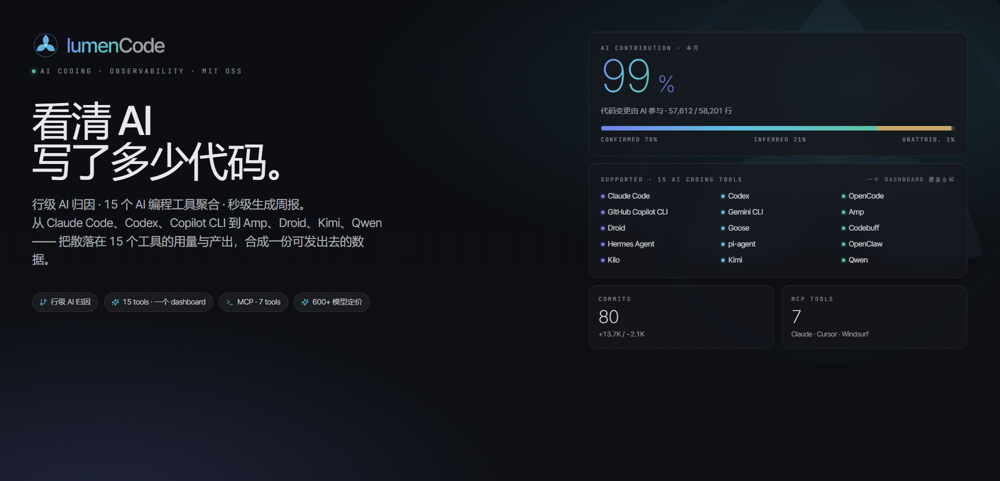

<div align="center">
  
</div>


<p align="center">
  <a href="https://www.npmjs.com/package/lumencode"></a>
  <a href="https://www.npmjs.com/package/lumencode"></a>
  <a href="https://github.com/yaowen51888-rich/lumencode"></a>
  <a href="LICENSE"></a>
  <a href="https://nodejs.org/"></a>
</p>

<p align="center">
  <b>AI 编码助手使用分析</b> —— 一行命令，看清 AI 到底帮你写了多少代码
</p>

<p align="center">
  15 工具统一 · 行级 AI 归因 · 600+ 模型成本估算 · 一键可发布周报
</p>

<p align="center">
  <a href="README.md">English</a> · <a href="#命令用法">命令</a> · <a href="#mcp-server">MCP</a> · <a href="#常见问题">FAQ</a> · <a href="#最近更新">更新日志</a>
</p>
<div align="center">
  
</div>

---


## 它解决什么问题？

> 「AI 帮你写了多少代码？」「订阅这些工具值不值？」—— 与其手算，一条命令搞定。

| 场景 | 用 LumenCode 解决 |
|------|----------------------|
| **精确量化 AI 贡献** | 不是模糊的“大概写了不少”，而是分别展示「AI 新增 3,180 行、删除 420 行」；贡献率按新增与删除组成的变更行数计算。**每一行都有数可查。** |
| **证明 AI ROI** | 周报自动生成：「本周 AI 辅助 12 个提交，新增 3,180 行、删除 420 行，花费 $18.5」。**每个数字都有出处。** |
| **3 秒写周报** | 选周期 → 点「工作汇报 → 复制」→ 粘贴飞书/钉钉。**3 秒搞定。** |
| **按项目汇报** | 多项目并行时，选择单个项目生成独立汇报，向不同负责人对齐 |
| **对齐 Sprint 周期** | 自定义任意起止日期，不再被日/周/月固定周期限制 |
| **追踪 AI 成本** | 600+ 模型内置定价（含 GLM/Kimi/Qwen/DeepSeek），自动算出等效 API 花销 |

---

## 和 `ccusage` 有什么区别？

LumenCode 和 [`ccusage`](https://github.com/ccusage/ccusage) 读的是同一批本地日志、支持同一组 15 款 agent CLI。差别在"拿到数据能做什么"——LumenCode 在此之上多了 Web UI、MCP 服务、行级 AI 归因。

| | **ccusage** | **LumenCode** |
|---|:---:|:---:|
| **形态** | CLI | **CLI + Web UI + MCP** |
| **行级 AI 归因** | — | ✅ "这一行是 AI 写的" |
| **可发布周报** | 终端 / JSON | **Markdown / 飞书 / 钉钉** · 详报 / 简报 |
| **AI 智能周报** | — | ✅ 调本地 agent 出分析 |
| **可视化钻取** | — | ✅ 点图表 → 会话 / commit |
| **支持工具** | 15 | 15（同一组） |
| **成本 / 定价** | ✅ 离线 + 自定义覆盖 | ✅ **600+ 模型**内置（GLM / Kimi / Qwen / DeepSeek） |

> ccusage 是一个优秀的高速 CLI，我们从中汲取灵感。LumenCode 读的是同一份 `~/.claude` 日志，两者并存零冲突。

---

## 环境要求

- Node.js >= 20.0.0
- 原生 SQLite 依赖（`better-sqlite3`，`npm install` 时自动编译）
- 已安装[支持的工具](#支持的工具与数据目录)中至少一个，并产生过会话日志

---

## 支持的工具与数据目录

15 款 AI 编码工具，全部 ✅ 完整支持（会话级 / Token 级 / 模型级统计）。

| 工具 | 默认日志目录 | 环境变量（可选） |
|------|-------------|-----------------|
| **Claude Code** | `~/.claude` | `CLAUDE_DIR` |
| **OpenAI Codex** | `~/.codex` | `CODEX_DIR` |
| **OpenCode** | `~/.opencode` | `OPENCODE_DIR` |
| **Gemini CLI** | `~/.gemini` | `GEMINI_DIR` |
| **Qwen Code** | `~/.qwen` | `QWEN_DIR` |
| **Goose** | `~/.local/share/goose` | `GOOSE_DIR` |
| **Amp** | `~/.local/share/amp` | `AMP_DIR` |
| **Hermes Agent** | `~/.hermes` | `HERMES_DIR` |
| **OpenClaw** | `~/.openclaw` | `OPENCLAW_DIR` |
| **Kimi CLI** | `~/.kimi` | `KIMI_DIR` |
| **Codebuff** | `~/.config/manicode` | `CODEBUFF_DIR` |
| **Droid** | `~/.factory/sessions` | `DROID_DIR` |
| **Pi Agent** | `~/.pi/agent/sessions` | `PI_AGENT_DIR` |
| **Kilo** | `~/.local/share/kilo` | `KILO_DATA_DIR` |
| **GitHub Copilot CLI** | `~/.copilot/otel` | `COPILOT_OTEL_FILE_EXPORTER_PATH` / `COPILOT_DATA_DIR` |

> 未列出环境变量时，按默认目录自动检测；多账号可用逗号分隔多个目录。

---

## 3 秒上手

```bash
# 全局安装（指定最新版本）
npm install -g lumencode@latest
lumencode serve            # 启动 Web 服务，自动打开浏览器

# 验证版本（确保 ≥ 1.4.0）
lumencode --version

# 或零安装直接使用
npx lumencode@latest serve
```

> ⚠️ **遇到旧版本？** 运行 `npm cache clean --force && npm install -g lumencode@latest` 强制刷新缓存后重装。

**零配置开箱即用** —— 首次运行自动检测上表全部 15 款工具的日志目录，从会话元数据推导项目路径，无需手动配置。

---

## 产品亮点

> 核心：**行级归因 × 十五工具统一 × 精确成本 × 一键周报**——把 AI 编码的投入产出算到每一行、每一分钱。

| 亮点 | 说明 |
|------|------|
| 🎯 **行级 AI 归因** | 不止"AI 帮了这个提交"，而是"这行代码是 AI 写的"——hook 步骤追踪 + step 证据，精确到每一行 |
| 🔎 **归因证据下钻** | 每个提交可下钻查看逐行归因证据：命中的行、来源工具 / 会话 / 步骤、置信度——每个数字都能追溯到底 |
| 🌐 **十五工具统一** | Claude Code / Codex / Copilot 等 15 款工具日志自动汇总，一键切换、跨工具对比 |
| 🩺 **数据健康透明** | `doctor` 一键体检各工具日志解析状态（成功率、最近成功、异常），数据问题早发现 |
| 📝 **一键可发布周报** | 详报 / 简报秒生成，Markdown / 飞书 / 钉钉三格式，复制即粘贴，每板块附洞察解读 |
| 🤖 **AI 智能报告** | 调本地 Claude Code / Codex / OpenCode 之一，产出含亮点、洞察、风险、建议的分析报告，可选面向领导的「管理汇报」风格 |
| 💰 **精确成本估算** | 600+ 模型定价库（含 GLM/Kimi/Qwen/DeepSeek）+ Portkey API 兜底，未知模型按 $0 计——只报真实，不乱猜 |
| 📂 **按项目独立汇报** | 多项目并行，各自生成独立汇报（commits + AI 交互量 + 热点文件），向不同负责人对齐 |
| 📅 **Sprint 周期对齐** | 日 / 周 / 月之外，自定义任意起止日期，贴合迭代节奏 |
| 🔍 **趋势洞察** | 峰值日、连续活跃天数、工具使用五类分布一目了然，图表点击下钻到会话 / 提交 |
| 📦 **零配置开箱即用** | 首次运行自动检测工具目录、推导项目路径，装完即用 |
| 🌙 **亮 / 暗主题** | 暗色默认，全图表自适配 |

---

## 产品截图

### 数据分析总览

> 左侧数据源面板一键切换工具，主区域汇总 Token 消耗、费用、模型分布、AI 贡献度归因。

<table>
  <tr>
    <td></td>
    <td></td>
  </tr>
  <tr>
    <td align="center">汇总指标 + Token 趋势</td>
    <td align="center">项目分布 + 时段分布 + 会话列表</td>
  </tr>
</table>


### 多工具维度

> 切换到「全部工具」视图，查看跨工具的汇总数据与对比分析。


### 项目分布 & 会话记录

> 按项目统计 Token、费用、会话数，点击下钻查看单条会话明细。


### 场景分析

> 按工作类型分类（编码 / 测试 / 调试 / 文档 / 审查 / 规划），附匹配关键词示例。


### 工作汇报 · 一键生成可直接发布的周报

> 自然语言段落式汇报，覆盖 Token / 费用 / AI 贡献度 / 项目亮点 / 代码产出，每个板块附洞察解读。

- **详报** —— 完整数据 + 洞察解读 + 板块编号，适合周报、月报
- **简报** —— 3-5 句话核心摘要，适合日报或群消息
- **智能报告** —— 页面内调用本地 Claude Code / Codex / OpenCode 之一生成 AI 分析，含数据摘要、工作亮点、关键洞察、风险与建议
- **风格选择** —— 生成前可选默认风格，或「管理汇报」风格输出更适合向领导汇报的表达倾向
- **持久化与更新提醒** —— 智能报告按周期、项目、报告层级和风格保存；统计数据变化后提示重新生成
- **多平台格式** —— 标准 Markdown / 飞书 / 钉钉，一键切换
- **按项目生成** —— 右侧面板选择项目，生成该项目的独立汇报

<table>
  <tr>
    <td></td>
    <td></td>
  </tr>
  <tr>
    <td align="center"><b>详报</b></td>
    <td align="center"><b>简报</b></td>
  </tr>
</table>

### 亮色 / 暗色主题

> 全图表配色自适配，长时间阅读不伤眼。


> 暗色模式为默认主题，上方截图均为暗色模式下的效果。

### 设置页

> 在侧栏「设置」页面统一管理：15 个工具数据源目录、启用工具、成本计算口径、步骤追踪归因、场景关键词、外观偏好，按卡片分区。


---

## 命令用法

```bash
lumencode <命令> [周期] [日期] [选项]
```

| 命令 | 说明 |
|------|------|
| `serve` | 启动 Web 服务（默认端口 4567） |
| `report` | 生成命令行报告（默认命令） |
| `doctor` | 检查各工具日志的解析健康状态 |
| `init` | 初始化配置文件 |
| `hooks` | 开启/关闭行级归因 hook（详见[行级 AI 归因](#行级-ai-归因可选增强)） |
| `mcp` | 启动 MCP Server，供 Claude Code / Cursor 等调用（详见 [MCP Server](#mcp-server)） |

| 周期 | 说明 |
|------|------|
| `daily` | 日报（默认） |
| `weekly` | 周报（自动计算所在周） |
| `monthly` | 月报（自动计算所在月） |

### 常用示例

```bash
# Web 模式（推荐）
lumencode serve

# 命令行日报
lumencode report daily
lumencode report daily 2026-05-15

# 周报 / 月报
lumencode report weekly
lumencode report monthly 2026-05-01

# 只统计指定项目
lumencode report daily --projects D:/fzwork,E:/play/idea

# 一键生成可发布的工作汇报
lumencode report daily --work          # 详报
lumencode report daily --work --brief  # 简报
lumencode report weekly --work
```

---

## MCP Server

LumenCode 内置 MCP Server，把 AI 编码分析能力暴露为 7 个工具，可供 **Claude Code / Cursor / Windsurf** 等支持 MCP 的客户端直接调用——在对话里就能查用量、生成周报、分析代码贡献度，无需切换到 Web 界面。

### 工具清单

| 工具 | 说明 |
|------|------|
| `usage_summary` | AI 用量概览：Token 消耗、成本、会话数、模型分布 |
| `daily_report` | 生成指定日期的使用报告（Markdown） |
| `work_report` | 工作汇报（周报/月报），支持 normal / brief / boss 三种风格 |
| `session_list` | 列出指定时间范围内的 AI 编码会话 |
| `trend_analysis` | 用量趋势：日级 Token、成本、请求量变化 |
| `ai_contribution` | 指定仓库的 AI 代码贡献度：贡献率、commit 归因、热点文件 |
| `cost_breakdown` | 成本分解：按模型 / 项目统计费用与缓存命中率 |

### 配置方式

**方式一：全局安装后（推荐）**

```bash
npm install -g lumencode@latest
```

在客户端的 MCP 配置中添加（以 Claude Code 的 `settings.json` 为例）：

```json
{
  "mcpServers": {
    "lumencode": {
      "command": "lumencode-mcp"
    }
  }
}
```

**方式二：源码 / 开发模式**

```json
{
  "mcpServers": {
    "lumencode": {
      "command": "node",
      "args": ["src/mcp/server.js"]
    }
  }
}
```

Cursor / Windsurf 等客户端的配置字段名同为 `mcpServers`，按各自设置入口填入即可。也可用 `npm run mcp` 或 `lumencode-mcp` 直接前台启动调试。

### 特性

- **零配置**：自动检测所有支持工具的日志目录，从会话推导项目路径，无需手动指定
- **stdio 传输**：标准 MCP stdio 协议；首次调用时扫描并缓存日志，后续复用
- **结果一致**：所有工具与 Web 端 / CLI 共用 `lib/` 下的统计与归因实现

配置完成后即可在 AI 助手中直接提问，例如「我这周 AI 编码花了多少成本？」「分析 idea 仓库的 AI 贡献度」「生成本周工作汇报」。

---

## 配置

**首次运行自动检测**已安装工具的日志目录与项目路径。如需自定义，在左侧侧栏打开「设置」页面在线修改。设置按卡片分区：数据源、代码仓库、计费与成本、归因与追踪、场景分类、外观偏好。

| 配置项 | 说明 |
|--------|------|
| 各工具日志目录 | 15 款工具的数据目录，默认按上表自动检测，可在设置页或 `config.json` 覆盖 |
| 启用工具 | 指定启用哪些工具，默认全部已检测到的工具 |
| 本地项目路径 | 关联的 Git 仓库路径，用于代码提交统计与 AI 贡献度归因 |
| 排除项目 | 不希望统计的项目名称 |
| 场景关键词 | 工作类型分类关键词 JSON |
| 成本计算口径 | 成本来源：`auto`（优先用日志成本，缺失则按定价估算）· `calculate`（始终按 token 定价重算）· `display`（仅展示日志原值） |
| 步骤追踪 | 行级归因的步骤记录开关，详见[行级 AI 归因](#行级-ai-归因可选增强) |
| AI 归因参数 | 归因评分的阈值/权重等专家参数，UI 仅只读预览；如需修改请直接编辑 `config.json` |

### 行级 AI 归因（可选增强）

行级归因通过 AI 编程工具 hook 记录文件编辑步骤，把 AI 贡献从提交级 / 文件级细化到行级。Claude Code 优先使用 `PostToolBatch`，Codex 使用 `PostToolUse`，OpenCode 使用项目级插件。该功能默认按需启用：未初始化数据库时 hook 会静默跳过，不影响正常使用。在 Web 端，每个被归因的提交可下钻查看行级证据——具体命中的行，以及它们来自哪个工具 / 会话 / 步骤。

```bash
# 在需要统计的 Git 项目根目录执行
node index.js hooks status
node index.js hooks enable       # 交互式选择工具、初始化 steps 并自动备份配置
```

开启时只修改当前项目的本地配置（`.claude/settings.local.json`、`.codex/config.toml`、`.opencode/plugins/lumencode-step-tracker.js`），不影响全局配置或其它项目。关闭执行：

```bash
node index.js hooks disable
```

数据写入当前项目的 `.lumencode/steps.db`（含归因用的文件快照）。旧版本的 `.ccusage/steps.db` 会在首次使用时复制迁移到新路径；旧文件保留为回滚备份。

### 模型定价数据

- **本地表**：590 个来自 [Portkey-AI/models](https://github.com/Portkey-AI/models) 的厂商原命名定价
- **别名映射**：28 条权威覆盖，把 `glm-5.1` / `kimi-for-coding` 等中转服务别名定向到正确定价
- **API 兜底**：未命中的新模型自动调用 Portkey 免费 API，结果缓存到 `data/pricing-cache.json`，本地 + 兜底覆盖 600+ 模型
- **失败降级**：API 不可用时该模型按 $0 计费，不影响其他模型与报告生成

---

## 常见问题

| 问题 | 解决方案 |
|------|----------|
| 浏览器显示「暂无数据」 | 首次启动会引导配置；如已跳过，在左侧侧栏打开「设置」页面 |
| Windows 下日志目录不存在 | 默认路径为 `C:\Users\<用户名>\.claude`，确认该目录下有 `projects/` 子目录 |
| 端口 4567 被占用 | 设置环境变量：`set LUMENCODE_PORT=8080 && lumencode serve` |
| 找不到 Git 统计数据 | 已自动从会话 `cwd` 推导项目路径，仍未识别时可在设置中手动指定 |
| 费用显示 $0 | 该模型未在定价表中，可临时联网让 API 兜底，或在 `data/pricing.json` 的 `overrides` 中添加 `aliasOf` 别名 |
| 智能报告不可用 | 智能报告需本地 Claude Code / Codex / OpenCode 之一可调用，请确认对应命令在终端 PATH 中 |

---

## 最近更新

📖 [完整更新日志 → Releases](https://github.com/yaowen51888-rich/lumencode/releases)

---

## 支持项目

如果这个工具帮到你，不妨：

- **给个 Star** —— 让更多人看到这个工具
- **提 Issue** —— 报告 Bug 或建议新功能
- **提 PR** —— 欢迎贡献模型定价、场景关键词、工具适配

---

## 许可证

[MIT](LICENSE) © [zhangyaowen](https://github.com/yaowen51888-rich)
