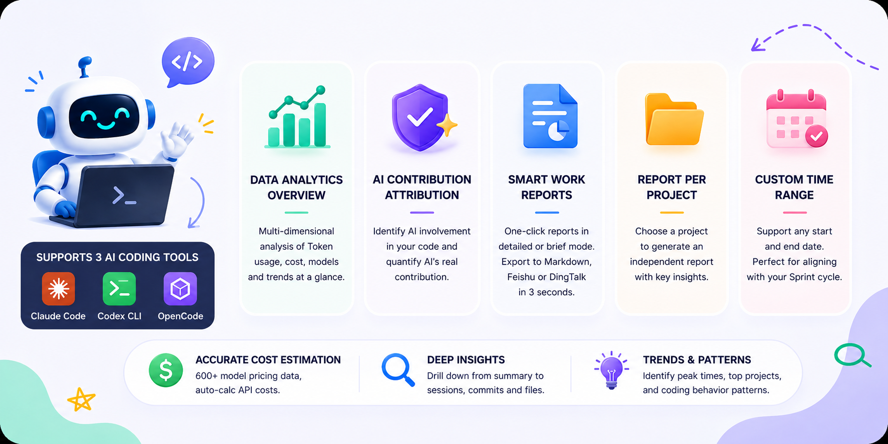

<div align="center">
  
</div>


<p align="center">
  <a href="https://www.npmjs.com/package/lumencode"></a>
  <a href="https://www.npmjs.com/package/lumencode"></a>
  <a href="LICENSE"></a>
  <a href="https://nodejs.org/"></a>
</p>

<p align="center">
  <b>AI Coding Assistant Analytics</b> — Line-Level AI Attribution · Three-Tool Unified · Smart Weekly Reports
</p>

<p align="center">
  <a href="README.md">中文版</a> · <a href="#cli-usage">CLI</a> · <a href="#faq">FAQ</a> · <a href="#changelog">Changelog</a>
</p>
<div align="center">
  
</div>

---


## What problem does it solve?

> "How much code did AI write?" "Are these AI subscriptions worth it?" — Stop calculating manually. One command does it all.

| Scenario | Solved by lumencode |
|----------|--------------------------|
| **Precise AI Contribution** | Not vague "AI helped a lot" — "3,180 out of 4,200 lines were AI-assisted." **Every line accounted for.** |
| **Proving AI ROI** | Auto-generated weekly report: "This week AI assisted 12 commits, saved ~8 hours, cost $18.50." **Management gets it instantly.** |
| **Writing weekly reports** | Pick period → click "Work Summary → Copy" → paste into Lark/DingTalk. **Done in 3 seconds.** |
| **Per-project reporting** | Configure multiple projects, then select one to generate an independent work report for each project lead |
| **Sprint cycle alignment** | Beyond daily/weekly/monthly — pick any start/end date, no longer limited to fixed periods |
| **Tracking AI costs** | Built-in **600+ model pricing** (incl. GLM, Kimi, Qwen, DeepSeek), auto-calculates equivalent API cost |

---

## Get Started in 3 Seconds

```bash
# Global install (pin to latest)
npm install -g lumencode@latest
lumencode serve            # Start Web server, auto-opens browser

# If you have an older version installed, update first:
npm update -g lumencode

# Verify version (ensure ≥ 1.3.7)
lumencode --version

# Or run without installing
npx lumencode@latest serve
```

> ⚠️ **Stuck on an old version?** Run `npm cache clean --force && npm install -g lumencode@latest` to flush the cache and reinstall.

**Zero-config startup** — Auto-detects `~/.claude`, `~/.codex`, OpenCode log directories. Derives project paths from session metadata.

---

## Highlights

<div align="center">
  
</div>


| Highlight | Description |
|-----------|-------------|
| 🎯 **Line-Level AI Attribution** | Hook-based step tracking identifies AI participation for each line of code. Not "AI helped with this commit" — "This line was written by AI" |
| 🌐 **Three-Tool Unified** | Claude Code / Codex / OpenCode data auto-aggregated, sidebar tab to switch |
| 📝 **Natural Language Work Summary** | Detailed / Brief reports with insight commentary. Standard Markdown / Lark / DingTalk formats, one-click toggle |
| 🤖 **Smart Report Generation** | Connects to the local OpenCode CLI to analyze bounded statistics and source work reports, with Default and leadership-oriented "Workhorse" styles |
| 📂 **Per-Project Reports** | Select a project from the right panel to generate an independent report (commits + AI interaction volume + hotspot files) |
| 📅 **Custom Date Ranges** | Beyond daily/weekly/monthly — pick any start and end date, perfect for aligning with Sprint cycles |
| 💰 **Precise Cost Estimation** | 600+ model local pricing (incl. GLM/Kimi/Qwen/DeepSeek) + Portkey API fallback. Unknown models counted at $0, never guessed |
| 📦 **Zero-Config Out of the Box** | First run auto-detects tool directories and derives project paths |
| 🔍 **Data Drill-Down** | Click any chart to dive from aggregate stats to individual sessions/commits |
| 📈 **Trends & Insights** | Peak day detection, consecutive active streaks, tool usage 5-category distribution (editing/reading/execution/planning/research) |
| 🌙 **Light / Dark Theme** | Light/dark theme toggle, all charts auto-adapt |

---

## Screenshots

### Data Analysis Overview

> Switch tools from the left sidebar. Main area shows Token usage, cost, model distribution, and AI contribution attribution.

<table>
  <tr>
    <td></td>
    <td></td>
  </tr>
  <tr>
    <td align="center">Summary + Token Trends</td>
    <td align="center">Project Distribution + Hourly Activity + Session List</td>
  </tr>
</table>


### Multi-Tool Dimension

> Switch to "All Tools" view for cross-tool aggregate data and comparative analysis.


### Project Distribution & Sessions

> Per-project Token, cost, and session count stats. Click to drill down into individual session details.


### Scenario Analysis

> Categorize by work type (coding / testing / debugging / docs / review / planning), with matched keyword examples.


### Work Report · One-Click Publishable Weekly Report

> Natural-language paragraph reports covering Token / cost / AI contribution / project highlights / code output, each section with insight commentary.

- **Detailed** — Full data + insights + numbered sections, ideal for weekly/monthly reports
- **Brief** — 3-5 sentence core summary, ideal for daily reports or group chat
- **Smart Report** — Calls the local OpenCode CLI from the page to generate AI analysis with data summary, work highlights, key insights, risks, and recommendations
- **Style Selection** — Choose Default style, or "Workhorse" for a leadership-reporting tone before generation
- **Persistence & Freshness Hints** — Smart reports are saved by period, project, report level, and style; stale source data prompts regeneration
- **Multi-Platform Format** — Standard Markdown / Lark / DingTalk, one-click toggle
- **Per-Project** — Select a project from the right panel to generate a project-specific report

<table>
  <tr>
    <td></td>
    <td></td>
  </tr>
  <tr>
    <td align="center"><b>Detailed</b></td>
    <td align="center"><b>Brief</b></td>
  </tr>
</table>

### Light / Dark Theme

> All chart colors auto-adapt for comfortable long sessions.


> Dark mode is the default theme — the screenshots above were taken in dark mode.

---

## CLI Usage

```bash
lumencode <command> [period] [date] [options]
```

| Command | Description |
|---------|-------------|
| `serve` | Start Web server (default port 4567) |
| `report` | Generate CLI report (default command) |
| `init` | Initialize config file |
| `mcp` | Start MCP Server for Claude Code / Cursor etc. (see [MCP Server](#mcp-server)) |

| Period | Description |
|--------|-------------|
| `daily` | Daily report (default) |
| `weekly` | Weekly report (auto-calculates week range) |
| `monthly` | Monthly report (auto-calculates month range) |

### Examples

```bash
# Web mode (recommended)
lumencode serve

# CLI daily report
lumencode report daily
lumencode report daily 2026-05-15

# Weekly / Monthly
lumencode report weekly
lumencode report monthly 2026-05-01

# Specific projects only
lumencode report daily --projects D:/fzwork,E:/play/idea

# One-click publishable work summary
lumencode report daily --work          # Detailed
lumencode report daily --work --brief  # Brief
lumencode report weekly --work
```

---

## Configuration

v0.4.0+ supports Claude Code, Codex, and OpenCode. **Auto-detects** installed tools' log directories and project paths on first run.

For customization, click the settings button (top-right corner) in the Web UI.

| Setting | Description |
|---------|-------------|
| Claude Log Directory | Claude Code data directory (contains `projects/`), defaults to `~/.claude` |
| Codex Log Directory | Codex data directory (contains `sessions/`), auto-detected |
| OpenCode Log Directory | OpenCode data directory, auto-detected |
| Enabled Tools | Specify which tools to enable, defaults to all detected |
| Local Project Paths | Git repo paths for code commit stats and AI attribution |
| Excluded Projects | Project names to exclude |
| Scenario Keywords | Work type classification keyword JSON |

### Model Pricing Data

- **Local table** — 590 models pre-synced from [Portkey-AI/models](https://github.com/Portkey-AI/models) with vendor canonical names
- **Alias mapping** — 28 authoritative overrides mapping aggregator aliases (`glm-5.1`, `kimi-for-coding`) to correct pricing
- **API fallback** — Unknown models auto-queried via Portkey's free API, results cached to `data/pricing-cache.json`
- **Graceful degradation** — When API is unavailable, the model is counted at $0 (won't be guessed), other models unaffected

---

## MCP Server

LumenCode ships with a built-in MCP Server that exposes its AI coding analytics as 7 tools, callable directly from **Claude Code / Cursor / Windsurf** and other MCP-compatible clients — query usage, generate weekly reports, and analyze code contribution right in the conversation, no need to switch to the Web UI.

### Tools

| Tool | Description |
|------|-------------|
| `usage_summary` | AI usage overview: token consumption, cost, session count, model distribution |
| `daily_report` | Generate a usage report for a given date (Markdown) |
| `work_report` | Work summary (weekly/monthly), supports normal / brief / boss styles |
| `session_list` | List AI coding sessions within a time range |
| `trend_analysis` | Usage trends: daily token, cost, and request volume |
| `ai_contribution` | AI code contribution for a repo: contribution rate, commit attribution, hotspot files |
| `cost_breakdown` | Cost breakdown: per-model / per-project spend and cache hit rate |

### Configuration

**Option 1: After global install (recommended)**

```bash
npm install -g lumencode@latest
```

Add to your client's MCP config (Claude Code `settings.json` shown):

```json
{
  "mcpServers": {
    "lumencode": {
      "command": "lumencode-mcp"
    }
  }
}
```

**Option 2: Source / dev mode**

```json
{
  "mcpServers": {
    "lumencode": {
      "command": "node",
      "args": ["src/mcp/server.js"]
    }
  }
}
```

Cursor / Windsurf and other clients use the same `mcpServers` field — enter it via their respective settings. You can also run `npm run mcp` or `lumencode-mcp` directly in the foreground for debugging.

### Highlights

- **Zero-config** — Auto-detects `~/.claude` / `~/.codex` / OpenCode log directories and derives project paths from sessions
- **stdio transport** — Standard MCP stdio protocol; scans and caches logs on first call, reuses thereafter
- **Consistent results** — All tools share the same `lib/` stats and attribution implementations as the Web UI and CLI

Once configured, ask your AI assistant directly, e.g. "How much did AI coding cost me this week?", "Analyze AI contribution for the idea repo", or "Generate this week's work summary".

---

## FAQ

| Issue | Solution |
|-------|----------|
| Browser shows "No Data" | First run will guide you through config; if skipped, click settings button (top-right) |
| Log directory not found on Windows | Default path is `C:\Users\<username>\.claude`, ensure `projects/` subdirectory exists |
| Port 4567 in use | Set env variable: `set LUMENCODE_PORT=8080 && lumencode serve` |
| Git stats not found | v0.2.0+ auto-derives project path from session `cwd`. Manual override available in settings |
| Cost showing $0 | Model not in pricing table — try with network connection to let API fallback resolve, or add an `aliasOf` entry in `data/pricing.json` overrides |

---

## Requirements

- Node.js >= 18.0.0
- At least one of Claude Code / Codex / OpenCode installed with existing session logs

---

## What's New

### v1.3.7 (2026-06-25)

MCP Server (7 analytics tools) · AI-Metrics trailer line-level attribution · Smart report leadership-summary quality constraints · Dashboard/report query caching & parallelization · Attribution and date-filter fixes

### v1.3.5 (2026-06-11)

Data snapshot scope constraints · Extrapolation uncertainty labels · Codex line attribution fix · Cross-agent style sharing · SMART REPORT visual enhancements

📖 [Full changelog → Releases](https://github.com/yaowen51888-rich/lumencode/releases)

---

## Support This Project

If this tool helps you:

- **Star this repo** — Help others discover it
- **File an issue** — Report bugs or request features
- **Open a PR** — Contributions welcome for model pricing, scenario keywords, or new tool adapters

---

## License

[MIT](LICENSE) © [zhangyaowen](https://github.com/yaowen51888-rich)
